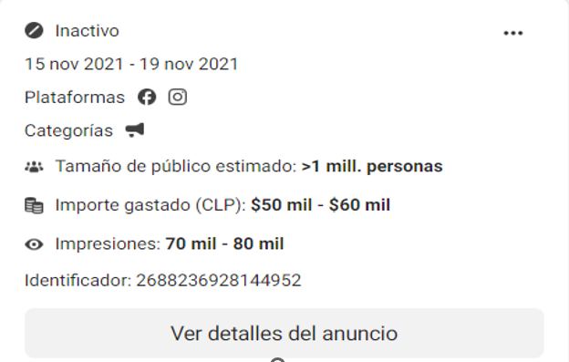
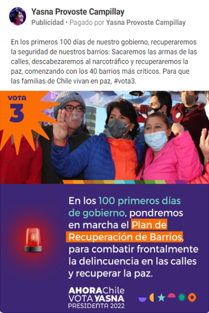

```{r setup, include=FALSE}
library(readr)
library(quanteda)
library(quanteda.textplots)
library(text2vec)
library(tidytext)
library(tidyverse)
library(ggplot2)
library(lubridate)
library(seededlda)
library(data.table)
library(tinytex)
library(knitr)
library(textclean)
library(kableExtra)
library(fastDummies)
```

\newpage

```{=latex}
\setcounter{tocdepth}{5}
\tableofcontents
\centering
\justifying
```
\newpage

# Introducción

A estas alturas resulta innegable reconocer el enorme impacto que está teniendo la revolución digital en todas las esferas de la vida social. El avance y penetración acelerada de internet en la mayoría de los países del mundo, la multiplicación exponencial de los aparatos y dispositivos digitales en los hogares para su uso cotidiano a bajo costo, y la variedad y volumen de información que circula día a día por todos los rincones del planeta, han generado un intenso debate académico, político y social que solo sigue creciendo. Si nos concentramos solamente en el día en que esta introducción fue escrita, se postearon 655.000.000 de mensajes en Twitter, 77.000.000 de fotos fueron publicadas en Instagram, 6.307.000.000 videos de YouTube fueron visualizados y 214.350.000.000 de emails fueron enviados[^1].

[^1]: Datos consultados en: <https://www.internetlivestats.com>

La abundancia, volumen y variedad de datos, y la velocidad con que se producen, ha transformado profundamente la manera de gobernar, de debatir, de hacer negocios, y también la de investigar. En particular en el campo de las comunicaciones, nos encontramos ante el desafío de producir estudios con una gigantesca cantidad de material empírico, sin precedentes en la historia de la ciencia, el cual requiere ser procesado, limpiado, clasificado e interpretado de manera adecuada, con el fin de responder a las nuevas interrogantes del presente. Este trabajo busca contribuir a la exploración de nuevos aspectos inscritos en la discusión mayor sobre la era digital y su impacto en la comunicación política. En particular, nos hemos centrado en la relación entre publicidad política en redes sociales y campañas electorales, indagando sobre la manera en que se envía propaganda diferenciada a segmentos de audiencia cada vez mejor perfilados, utilizando las potencialidades de la minería de datos y la construcción de algoritmos inteligentes. Este fenómeno ha sido bautizado bajo el nombre de microtargeting online.

Dentro de la evolución de la dimensión digital en su relación con la comunicación política y las campañas electorales, la que parte aproximadamente a comienzos de la década del 2000 con el uso de blogs, email y páginas web, llama la atención en los últimos años la creciente utilización de grandes volúmenes de datos recogidos desde diversas fuentes, entre ellas las redes sociales, y de sofisticados softwares de análisis estadístico orientados hacia el Big Data. Su objetivo central es ser capaz de segmentar al electorado con una alta precisión, para luego construir nichos específicos, o perfiles, a los cuales se les envían mensajes de campaña ad-hoc a sus patrones de preferencias, hábitos y orientación ideológica, a través de anuncios pagados en las plataformas de mayor uso (Instagram, You Tube, Facebook). Esta estrategia, el microtargeting online, si bien no cuenta con una definición operativa consensuada en el ámbito académico, ya ha empezado a ser descrita y abordada crecientemente en la literatura (Lopez Ortega, 2021).

Las nuevas posibilidades que existen en materia de propaganda política online, con un bajo costo y mayor efectividad para alcanzar al electorado con mensajes precisos y dirigidos, han ido ganando terreno rápidamente en diversas latitudes del mundo. Esto inevitablemente ha significado una mutación en la manera de pensar, organizar y ejecutar las campañas políticas, lo que también ha repercutido en la tradicional relación que se establece entre partidos y candidatos con el entorno mediático.

Las transformaciones recién señaladas, han despertado el interés por entender la mecánica y la operatoria de la nueva forma de hacer campañas, y de qué manera podrían beneficiar a los sistemas democráticos, acercando a la ciudadanía nuevamente hacia sus representantes políticos, estimulando la participación y el debate público, con la ayuda de los potentes avances tecnológicos que la revolución digital ha habilitado. Sin embargo, luego de la elección de Donald Trump en las elecciones norteamericanas de 2016 y del descubrimiento del caso de Cambridge Analytica, se despertaron también grandes temores sobre los efectos perniciosos que podría tener el uso de información de las personas en el despliegue de estas estrategias de campaña. Los medios de prensa y analistas de opinión han alertado crecientemente sobre la materia: los peligros de manipulación política, polarización extrema, uso indebido de datos privados, desinformación y noticias falsas, burbujas de opinión y cámaras de eco, como también el ascenso de líderes anti-democráticos de corte autoritario. Todo lo anterior ha abierto un gran debate, el que incluso ha estimulado la formulación de visiones distópicas sobre el futuro de la democracia y la libertad de las personas. Pero, ¿cuánto realmente sabemos sobre los contornos del fenómeno? Las investigaciones aún son insuficientes, pero ya han ido surgiendo evidencias de que la situación es menos apocalíptica de lo que parece. Contribuir a despejar mitos y establecer mejores bases empíricas que den cuenta del fenómeno en Chile, para una mayor comprensión, es uno de los objetivos centrales del presente estudio.

En el caso de Chile, la acelerada entrada y masificación del uso de internet y redes sociales ha creado las condiciones propicias para la rápida adopción de estas nuevas modalidades de campaña. En Febrero de 2022, se registraron 17.7 millones de usuarios de internet, equivalente al 92% de la población total del país. Una cifra similar se observa en materia de usuarios activos en redes sociales, destacando Facebook como la plataforma más utilizada por los chilenos, con un total aproximado de 12.5 millones de personas con cuentas activas[^2]. Lo anterior nos permite afirmar que esta es la red social que mejores posibilidades ofrece para la publicidad electoral online, permitiendo alcanzar una enorme audiencia de potenciales votantes. Por este motivo, nuestro estudio se concentrará en observar la forma en que se desarrolló el microtargeting online a través de la publicidad pagada en Facebook durante la elección presidencial de 2021.

[^2]: Estadísticas de la situación digital en Chile 2021-2022. Consultado en: <https://branch.com.co/marketing-digital/estadisticas-de-la-situacion-digital-de-chile-en-el-2021-2022>.

En la siguiente sección de este trabajo, se entregan un conjunto de elementos de contexto que permitan comprender de mejor manera el escenario en que se ubica la investigación. Por un lado, la transformación acelerada de la manera en que se planifican y ejecutan las campañas políticas en su dimensión comunicacional y de propaganda, con un uso cada vez más intensivo de datos masivos, inteligencia artificial y segmentación de perfiles de audiencia, y por otro la descripción del escenario político social de Chile en los últimos años, de alta polarización, conflictividad e inestabilidad, catalizado por un proceso de redacción de una nueva constitución política demandada por una inmensa mayoría de la sociedad, cuestión que a la vez se cruza con una aguda crisis de legitimidad y confianza en las instituciones, que ha abierto paso a un reemplazo significativo de las elites políticas que conducen los destinos del país.

A continuación, se aborda la revisión de la literatura académica que ha abordado nuestra temática en estudio, tanto a nivel nacional como internacional, resaltando en ella los principales enfoques teóricos, estrategias metodológicas y evidencias empíricas. En la sección siguiente se describe el planteamiento del problema que guía y orienta los esfuerzos de esta investigación, el cual deriva en preguntas de investigación, y un cuerpo de objetivos generales y específicos. Además, se informa la pertinencia, relevancia y justificación del estudio en su conjunto.

El capítulo 3 se centra en el enfoque teórico asumido en el presente estudio y los conceptos principales a utilizar en el análisis de la información recogida, con el fin de arrojar luz sobre la pregunta de investigación. Se reseñan los autores escogidos y el debate teórico en que se inscribe este trabajo. Luego, en el capítulo metodológico, se reportan los principales fundamentos, técnicas de análisis y fuentes de obtención de datos, como también los pasos seguidos para ordenar, limpiar y sistematizar la información que posteriormente será analizada. Por otra parte, se presenta la matriz de análisis de la investigación con las principales categorías a ser utilizadas.

La siguiente sección contiene los resultados del estudio, organizado según dimensiones de análisis para la primera y segunda vuelta de la elección presidencial, respectivamente. En este acápite se desarrolla la discusión de los hallazgos a la luz de los principales conceptos y enfoques teóricos elegidos. Finalmente, se entregan un conjunto de conclusiones sobre el trabajo realizado y algunas líneas posibles de ser indagadas en futuras investigaciones sobre la materia.

\newpage

# Problematización

## Antecedentes

### La revolución de los datos y la Cuarta Revolución Industrial

La transformación en la manera de fabricar la propaganda política que se distribuye online en contexto de campañas no puede ser entendida a cabalidad si no observamos el telón de fondo en que se mueve el fenómeno que estamos analizando en este trabajo.

Cuando hablamos de las tendencias que están impactando a las sociedades contemporáneas, el acelerado cambio tecnológico está entre las más destacadas y sobresalientes, junto con los factores demográficos, el cambio climático y la globalización. La era actual está reestructurando su fisonomía interna a partir del cambio tecnológico. De partida, podemos hablar de una revolución tecnológica, la digital específicamente, que es transversal y está irradiada por todas partes. Pero para ser más precisos, en realidad deberíamos hablar de varias revoluciones tecnológicas simultáneas: la automatización, la tecnología de nube, el internet de las cosas (IoT), la robótica avanzada, la biotecnología, el almacenamiento de energía, la impresión 3D, entre otras (Salazar-Xirinachs, 2018)

Según Malvicino y Yoguel (2015), nos encontramos frente a una "Revolución Industrial de los Datos" precedida desde fines del siglo pasado por las innovaciones tecnológicas y los dispositivos digitales. Este fenómeno se caracteriza por un aumento exponencial en la cantidad y diversidad de datos disponibles en tiempo real, derivado de un mayor uso de equipos tecnológicos de alta capacidad en la vida diaria. Se habla entonces de "Big Data" o más bien de "Big Data Analysis" (Hilbert, 2013) como un fenómeno global que puede llegar a tener un impacto económico real y potencial, beneficiando tanto al sector público y privado, en el aumento de la productividad, la competitividad sectorial y la calidad de vida de las personas.

Este conjunto de avances tecnológicos está teniendo impactos significativos en diversas áreas, tales como los modelos de negocios, el mundo del trabajo, el diseño e implementación de políticas públicas, la gestión de las organizaciones, la investigación científica y la academia en general. La velocidad de los cambios de por si va moldeando nuestra época histórica, pero en particular lo que más influye es la convergencia de varias de estas tecnologías.

Las grandes fuerzas impulsoras de esta "Cuarta Revolución Industrial" pueden ser agrupadas en torno a tres grandes grupos, estrechamente interrelacionados entre sí, y cuyas mejoras y avances individuales impactan al resto. Estos son: componentes físicos (robótica avanzada, impresión 3D, vehículos autónomos), digitales (el IoT, que dicho en simple sería descrito como la relación entre las cosas y las personas, a través de sensores, conexiones y plataformas), y biológicos (secuenciación y modificación genética). Cada uno de ellos, por cierto, con sus respectivas ramificaciones y aplicaciones específicas (Schwab, 2016)

Por otra parte, cuando hablamos de Industria 4.0, nos referimos a un nuevo paradigma de producción basado en la convergencia de la Inteligencia Artificial (IA), que posibilita la analítica avanzada de los datos y la interfaz humano/máquina, el internet de las cosas (IoT), que permite que los aparatos se comuniquen entre sí, a través de una verdadera revolución en sensores y artefactos inteligentes, la impresión 3D y la robótica (Salazar-Xirinachs, 2018). Mirado todo en conjunto, estamos siendo testigos de la creación acelerada y vertiginosa de artefactos, fábricas y logísticas inteligentes.

Las fábricas inteligentes son cada vez más una realidad patente: máquinas en red que "hablan" entre ellas y que combinan el mundo físico de la transformación de materiales con el mundo virtual de la información en tiempo real, la automatización y el control digital. Las logísticas inteligentes en las cadenas de valor están revolucionando desde los métodos de entrega del producto hasta el mantenimiento, pasando por el servicio al cliente y el servicio post-venta. Todo esto con grandes oportunidades para incrementar la productividad y aumentar la flexibilidad para el diseño y la producción (Salazar-Xirinachs, 2018). Desde el punto de vista del funcionamiento de la economía, esta transformación está alcanzando niveles muy profundos, de efectos e impactos aún en pleno desarrollo.

Dada la alta velocidad e irradiación del cambio tecnológico impulsado por datos, es posible observar también su impacto en la forma de hacer ciencia, investigación y generación de conocimiento. De hecho, la noción misma de "datos masivos", surge inicialmente en el contexto del trabajo científico en genética y astronomía, disciplinas que ya hace un par de décadas se toparon con un explosivo aumento de la data disponible para la investigación académica. Con el paso de los años, y a través de la convergencia de disciplinas como las matemáticas, la estadística, la computación y el diseño gráfico, es que comienza a surgir un nuevo campo de trabajo y estudio ad-hoc: la ciencia de datos. Según Mayer-Schonberger y Cukier:

"Medio siglo después que los ordenadores se propagaran a la mayoría de la población, los datos han empezado a acumularse hasta el punto de que está sucediendo algo nuevo (...) No sólo es que el mundo esté sumergido en más información que en ningún momento anterior, sino que esa información está creciendo más deprisa. El cambio de escala ha conducido a un cambio de estado. El cambio cuantitativo ha llevado a un cambio cualitativo. Fue en ciencias (...) donde se acuño el término"Big Data", o datos masivos. El concepto ahora está trasladándose ahora hacia todas las áreas de la actividad humana" (p.17, 2013)

Esta abundancia de datos, de dispositivos digitales y de softwares capaces de procesarlos, combinado con los conocimientos acumulados desde la disciplina del marketing, constituye el principal resorte del fenómeno que pretendemos indagar en esta investigación, aplicado a las campañas electorales. Pero la comunicación política y las formas que adoptan las campañas están fuertemente vinculadas también a los procesos sociales y a los entramados político-institucionales de cada país. Por lo anterior, a continuación se mencionan algunos elementos de contexto qu e aporten claridad para comprender el momento y el lugar en que se sitúa la elección presidencial chilena de 2021, que es nuestro caso de estudio.

### El escenario político chileno de cara a las elecciones presidenciales 2021: crisis de legitimidad, Covid-19, y reestructuración del sistema político

Hace varios años que se viene discutiendo, tanto en la esfera política como también en la académica, de una profunda crisis sistémica que afecta las bases mismas de la institucionalidad chilena. Se le ha denominado de diversas maneras: crisis de confianza, crisis de representación, crisis de malestar subjetivo, crisis de legitimidad, etc. Este fenómeno no solo sería padecido por nuestro país, sino por la región latinoamericana completa. Los principales argumentos tienen que ver con la desigual distribución de la riqueza, la exclusión de amplios sectores sociales marginados de los beneficios del desarrollo, el profundo desprestigio de los dispositivos de representación política, y una fuerte erosión de la relación entre Estado y ciudadanía (Garretón et al, 2016; Mayol, 2012; Atria et al, 2013)

Con este telón de fondo, la situación del país necesita ser descrita en función de sus particularidades históricas. Chile en general ha sido considerado como una de las democracias más estables de la región, y en los últimos 30 años como un ejemplo de desarrollo económico y creación de riqueza y oportunidades.

Luego del fin de la dictadura militar (1973-1990), los estudios han destacado dicha estabilidad política a través de la solidez del sistema de partidos en el período de transición democrática, y el avance simultáneo de la desafección y desanclaje de la ciudadanía respecto de las instituciones y los asuntos políticos, cuyos indicadores principales son la notoria baja aprobación de los partidos y las instituciones, la abstención electoral, y el declive en la participación militante (Alenda, 2009; Fuentes, 1999; Luna y Rosenblatt, 2012; Avendaño y Sandoval, 2016). Bajo ese escenario, las elecciones periódicas y las campañas políticas se desarrollaban en un ambiente de normalidad, con los partidos políticos estructurados en torno a dos polos, uno de centroizquierda y otro de centroderecha, los que conducían el proceso en su conjunto, la selección de candidatos, la oferta programática, a través de un estilo de campañas crecientemente influido por las prácticas del marketing. Lo anterior iba acompañado de un ecosistema mediático altamente centralizado, el cual transmitía sin contrapesos los procesos electorales y era el espacio preferente de los principales candidatos para entregar sus mensajes de campaña a la ciudadanía. Esta, a su vez, respondía con un comportamiento electoral estable, lo que hacía relativamente predecibles los resultados.

Sin embargo, hacia fines de la primera década del nuevo siglo comienzan a verse los primeros síntomas de desgaste en el sistema, cuestión que se reflejó en cierta medida en la elección presidencial del año 2009, en la que por primera vez se rompe notoriamente el equilibrio de una de las dos coaliciones políticas bisagra a través de una candidatura outsider representada por Marco Enríquez-Ominami, quien obtuvo el 20% de los votos en primera vuelta desplegando una campaña novedosa y que introduce por primera vez el uso de redes sociales como herramienta de propaganda y vinculación con el electorado, sin explotar aún todas sus potencialidades.

De ahí en adelante, y a la par de la creciente presencia de movimientos sociales masivos en las calles, del aumento cada vez más intenso del malestar subjetivo con la política y las instituciones, registrada en los estudios de opinión pública y cuyo clímax fue la revuelta social de 2019, surgen nuevas indagaciones y preguntas para abordar el tema. Dentro de ellas, destaca aquella que retoma la mirada sobre el proceso político desde la perspectiva de la teoría de los clivajes, o fisuras generativas (Aguero y Tironi, 1999), las que explicarían las transformaciones del paisaje político nacional.

Chile habría estructurado su sistema político a partir de un clivaje doble (clerical/laico, izquierda/derecha) en el período que abarca desde fines del siglo XIX hasta el golpe militar de 1973. Luego, producto de la experiencia autoritaria (1973-1990) el nuevo panorama se ordenó en torno al conflicto democracia/autoritarismo en la etapa de transición a la democracia, el cual se fue progresivamente diluyendo con los años. En el tiempo presente, según algunos autores estaríamos en presencia de un posible nuevo clivaje que estaría reorganizando el sistema político en torno a la polaridad elite/pueblo (Visconti, 2021; Riveros y Selamé, 2020), la que además podría estar coexistiendo con la antigua división izquierda/derecha. Por lo anterior, es que algunos expertos han planteado que Chile se encuentra en medio de un momento populista, cuyo efecto se observa a lo largo y ancho de la vida política y social del país.

Por otra parte, un hecho que agudizó aún más esta crisis de legitimidad descrita fue el descubrimiento de prácticas masivas de financiamiento ilegal de la política y las campañas electorales, en la que se vieron involucrados personas y partidos de todo el espectro político. Sendas investigaciones pudieron comprobar que importantes grupos empresariales, entre ellos Penta, Ripley, Compañía de Aceros del Pacífico, SQM, Banco BCI, etc., entregaron grandes aportes en dinero a través de boletas de servicios falsificadas, a candidatos y ex autoridades públicas para financiar sus campañas y actividades públicas. Esto llevó a que se abrieran causas judiciales contra los responsables y un gran revuelo mediático que terminó por darle una estocada mortal al ya desprestigiado sistema político chileno.

Derivado de lo anterior, la entonces Pdta. Bachelet (2014-2018) convocó a un consejo de expertos para recibir recomendaciones que permitieran regular los principales aspectos relacionados con la transparencia de la función pública y la regulación de la relación entre dinero y política. La llamada "Comisión Engel", que fue encabezada por el prestigioso economista chileno Eduardo Engel, evacuó un informe algunos meses después en el cual se consignaban las áreas sensibles que debían ser intervenidas. Entre ellas, la necesidad de dictar una nueva ley de partidos políticos y nuevos controles destinados a regular las campañas políticas y los flujos de dinero que circulan en torno a ellas. Durante el año 2016 la mayoría de estas iniciativas fueron aprobadas por el Congreso Nacional, entre ellas la que regulaba la propaganda política en períodos de campaña electoral. En cuanto a la publicidad pagada en redes sociales, esta quedó considerada dentro de la legislación, pero no de manera explícita. Al observar los manuales de rendición de gasto electoral, aparece mencionada la plataforma Facebook, pero las otras grandes no. La fiscalización potencial que puede realizar el Servicio Electoral (SERVEL), queda muy debilitada al no haber normas más precisas y detalladas respecto al uso de este tipo de herramientas durante las campañas. Lo anterior permite a los candidatos y partidos eludir en parte el control de la publicidad digital en redes, pagar anuncios fuera de los plazos legales de las campañas, y manejar a discreción el tipo de contenido pagado que se difunde por estas vías.

La experiencia observada en el reciente ciclo electoral en Chile, donde se realizaron alrededor de 7 elecciones sucesivas desde el Plebiscito Constitucional de 2020 hasta la elección presidencial de 2021, indica que será necesario revisar la legislación para así poder regular de forma más efectiva este fenómeno. La normativa vigente que aborda la materia es la Ley 19.628 de Protección de la Vida Privada (1999), la que establece que para utilizar los datos personales de una persona se debe contar con el consentimiento previo e informado del titular y estos solo pueden ser usados para los fines con que fueron creados. Este cuerpo legal fue creado hace más de dos décadas, en un entorno tecnológico muy distinto del que existe en el presente, por lo que naturalmente presenta importantes vacíos de regulación. En la actualidad está en trámite en el Senado un nuevo proyecto de ley de protección de datos personales, ingresado el año 2017, que se hace cargo de los déficits en términos de la comercialización de los datos de personas, su uso indebido, pero a la vez buscando adaptarse a un entorno de acelerado cambio tecnológico, en el cual la producción de datos en grandes volúmenes es una realidad innegable.

### Cambridge Analytica: salto cualitativo en la forma de hacer campañas

Durante el año 2018, medios de prensa dieron a conocer que la consultora británico-estadounidense Cambridge Analytica había obtenido de manera irregular los datos de más de 50 millones de perfiles de ciudadanos norteamericanos en la plataforma Facebook, los que procesados a través de técnicas que combinaban diversas disciplinas como las ciencias del comportamiento, estadística y ciencias sociales computacionales, permitían crear un gigantesco y detallado mapa de preferencias y tendencias políticas de millones de personas. El paso siguiente, y el más importante, era bombardear con propaganda electoral a cada uno de estos nichos y perfiles, segmentando el tipo de mensajes a un nivel desconocido hasta ese momento. La empresa reconoció que había llegado a disponer de alrededor de 4000 "data points" para cada persona, logrando así un conocimiento profundo sobre las orientaciones, gustos y preferencias de los individuos (Richardson, Witzleb & Paterson, 2020).

Los servicios de Cambridge Analytica habían sido probados en primera instancia durante la campaña del Brexit el año 2016, asesorando al equipo que encabezaba la opción por retirar al Reino Unido de la Unión Europa. Luego de eso, y facilitado por los nexos de Steve Bannon, ex jefe de campaña de Donald Trump y posterior asesor estratega en la Casa Blanca durante su primer año de mandato, la compañía pudo desembarcar en EEUU para en primer lugar trabajar con el candidato a las primarias presidenciales republicanas Ted Cruz, el que consiguió un sorprendente segundo lugar en dicha elección, inmediatamente después de Trump, quien finalmente ganó la nominación para la elección presidencial de 2016. Esto les permitió posteriormente incorporarse en la primera línea de la campaña del candidato conservador, desplegando las mismas técnicas y conocimiento adquirido previamente. El resultado ya es conocido, y Donald Trump finalmente derrotó a Hillary Clinton, descolocando todos los pronósticos electorales elaborados por las encuestadoras en los meses previos. Una vez develado, el caso llegó al más alto nivel tanto en Norteamérica como en Reino Unido, particularmente en este último, gatillando una extensa investigación conducida por el parlamento británico por más de 1 año y medio. En ella desfilaron múltiples ejecutivos de empresas, incluido el propio fundador de Facebook Mark Zuckerberg, quien tuvo que reconocer que la obtención de los millones de datos por parte de C.A. constituía una falla mayor en la protección de la privacidad de los usuarios. De esta forma, el mundo se enteraba no sólo de este problema y sus responsables, sino que también de una nueva etapa en el desarrollo de las tecnologías de la información, de las campañas políticas, y de las posibilidades para predecir el comportamiento humano.

Luego de los escándalos derivados del caso de Cambridge Analytica, el foco de preocupación tanto a nivel de investigación como de regulación de marcos legales en Europa y EEUU, se dirigió a los aspectos potencialmente perniciosos asociados al uso de estos métodos y su impacto en la calidad de la democracia (Witzleb, 2021; Kruikemeier). El uso intensivo de datos personales, apunta al centro de los sistemas democráticos como una oportunidad para mejorar la vinculación entre sistema político y ciudadanía, y también como un riesgo. Abre la posibilidad de vincular a los partidos y candidatos de manera más directa y efectiva con los electores, a los que de otro modo sería difícil de alcanzar. Pero también se ha planteado que puede abrir la puerta para la intensificación del circuito de noticias falsas, la generación de burbujas de opinión y cámaras de eco que potencian la polarización de la sociedad y el fortalecimiento de liderazgos populistas de corte autoritario, considerando además las aristas legales respecto al uso de información personal de la gente. Una de las consecuencias visibles ha sido la creación de repositorios de anuncios y publicidad pagada en Facebook, que es la que se utilizará para efectos de este estudio, como también en Google y Twitter. El objetivo era avanzar en transparencia y accountability en el uso de las plataformas digitales y redes sociales, para que así cualquier persona o institución pudiera conocer el origen y los alcances de la publicidad que se inserta en dichas aplicaciones (Vrancken, 2022). Si bien es factible reconocer esto como un avance, también es cierto que las técnicas de minería de datos y segmentación de audiencias se alimentan de muchas otras fuentes no reguladas para construir los perfiles de personas, invisibles al escrutinio público y lejos del alcance de las investigaciones académicas.

La versión chilena de este conjunto de herramientas y disciplinas aplicadas a campañas electorales tiene su origen en la empresa Instagis, una pequeña iniciativa privada que se vio beneficiada por líneas de crédito provenientes de CORFO entre los años 2013 y 2015. Según indica un reportaje del medio CIPER: "El negocio consiste en cruzar distintas bases de datos con información de usuarios en redes sociales para predecir patrones de comportamiento, de consumo e incluso preferencias políticas. Así, cada vez que usted interactúa en su cuenta de Facebook, Twitter o Instagram, uno de los"robots" de Instagis puede monitorear ese contenido para luego cruzar la información con su RUT y domicilio, aunque estos últimos son datos personales que debiesen estar protegidos, pero los vacíos legales hacen que en la práctica no sea así" (CIPER, 2018).

Lo anterior se vio fortalecido por los múltiples contratos que la empresa fue suscribiendo desde el año 2016 en adelante, con distintos partidos, candidatos, municipios y entidades públicas asociadas a los partidos de centroderecha del país. De esta forma, Instagis fue recibiendo el "combustible" necesario para poder mejorar su servicio de segmentación de audiencias, es decir, la piedra angular para el microtargeting electoral aplicado a campañas.

Dada la intensa competencia por captar la atención de las audiencias, en un ambiente de abundancia y casi saturación de fuentes informativas sobre temas políticos, es posible entender la presión en la que se encuentran los actores y candidatos políticos por lograr una recepción eficiente de sus mensajes en contextos de campaña. En el caso específico de Chile, además, la instalación del voto voluntario el año 2012 impulsó a los competidores a identificar nichos potenciales de votantes, más que apuntar a la totalidad del electorado. La tecnología de segmentación o microtargeting, reforzada por el asesoramiento casi obligado de profesionales del marketing político, ha sido funcional a esta necesidad. En esta línea, la experiencia reseñada de la empresa Instagis en las elecciones presidenciales de 2017 asesorando a Sebastián Piñera, quien resultó electo, es pionera en este tipo de campañas orientadas por inteligencia de datos.

Luego de iniciado el período de protestas sociales de Octubre 2019 durante el gobierno de Piñera, como también se pudo observar en otros países como Perú, Ecuador o Colombia, en la cual se desataron multitudinarias movilizaciones ciudadanas a lo largo del país en torno a un conjunto de demandas por mayor igualdad y justicia social, y que puede ser entendida como el momento cúlmine y catártico de la crisis de legitimidad y confianza mencionada anteriormente, los partidos con representación parlamentaria acordaron abrir un proceso constituyente para redactar una nueva Constitución Política de la República con el fin de destrabar el conflicto y darle un cauce institucional y democrático. Pero el objetivo no era solo crear una constitución que fije nuevas reglas y avance en reducir las desigualdades estructurales que aquejan al país, sino también iniciar el camino para reconectar a los ciudadanos con la política, reducir la desafección y estabilizar a las instituciones.

El primer hito fue la realización de un plebiscito nacional en Octubre de 2020, el cual arrojó un resultado nítido: casi un 80% de los votantes aprobaron la idea de hacer una nueva Constitución y además decidieron, en una proporción similar, que el órgano redactor fuera electo en un 100% por la ciudadanía mediante elecciones democráticas. En medio de este escenario surge la súbita crisis sanitaria que azotó al mundo entero y por supuesto a nuestro país también: la pandemia del COVID-19. Mientras aún se seguían produciendo las protestas sociales contra el gobierno de Sebastián Piñera iniciadas a fines de 2019, y en plena discusión del itinerario constitucional que pretendía darle un cauce institucional a la crisis, los chilenos se vieron de pronto forzados a cumplir severas cuarentenas para frenar la cadena de contagios que afectaba al mundo entero amenazando la vida e integridad física de las personas. Entre las múltiples consecuencias que esto produjo, en todo orden de cosas, cabe destacar la notoria intensificación en el uso de herramientas y dispositivos digitales, en la medida que internet se convirtió en el mecanismo más importante para mantener funcionando las diversas dimensiones de la vida social (CEPAL, 2020) Con el paso de los meses, y conforme se iba agravando la situación sin que se supiera con mucha certeza hasta donde se extendería la emergencia sanitaria, fue posible observar una aceleración vertiginosa en la transformación digital de diversas actividades, algunas de las cuales ya estaban en proceso de incorporar dichas herramientas. El contexto de cuarentenas y del corte abrupto de la interacción cara a cara, llevó a este proceso a niveles insospechados. De esta manera, los circuitos comerciales se encontraron ante el desafío de intensificar y perfeccionar el e-commerce, los servicios educativos se vieron forzados a transitar rápidamente hacia formas de aprendizaje a distancia a escala masiva, el mercado laboral se adaptó en cosa de meses en torno al pre --existente trabajo remoto también en grandes escalas, la atención de salud pasó a su versión no presencial a través de los servicios de telemedicina, la vida social y el esparcimiento se empezó a trasladar a formatos virtuales a través de plataformas como Zoom, Google Meet, Microsoft Teams, y así la lista suma y sigue.

Dado lo anterior, y ante la proximidad de jornadas electorales importantes como el Plebiscito Constitucional, las elecciones municipales, elecciones de gobernadores regionales, elección de representantes ante la Convención Constituyente, etc., fuimos testigos del rápido reacomodo de las formas tradicionales de hacer campaña offline, para transitar hacia campañas donde el componente digital o campañas de aire se convirtió en el elemento decisivo. Lo anterior implicaba un rápido fortalecimiento de los equipos profesionales que normalmente asesoraban las campañas, y una mayor demanda por personas que conocieran en detalle las mejores alternativas para difundir los mensajes políticos a través de canales digitales, en particular las redes sociales, las que cobraron una preponderancia no vista hasta ese momento.

De esta manera, se entroncaron tendencias previas en el ámbito de las plataformas digitales que estaban penetrando desde hace varios años la forma de hacer campañas, con la necesidad urgente de concentrar los esfuerzos casi de manera exclusiva en el espacio digital. Una de estas tendencias, aquella que tiene que ver con la importación a Chile de técnicas de inteligencia electoral impulsada por datos masivos como la que se asocia a la experiencia de Trump, se vio favorecida por la imposibilidad de realizar campañas presenciales y la cada vez mayor preponderancia de las vías digitales.

Con todos estos antecedentes sobre la mesa, nos acercamos a la coyuntura específica de la elección presidencial de 2021 en que resultó electo Gabriel Boric. Esta fue una elección distinta a las anteriores por varios motivos. En primer lugar, Chile venía sacudido por la pandemia del COVID-19 y por los efectos del estallido social de 2019-2020. La apertura de un proceso constituyente promovido desde las calles del país, el ambiente polarizado y de alta politización respecto de asuntos de fondo como la organización del Estado, los derechos sociales, la crisis medioambiental, los derechos de las mujeres, el conflicto con los pueblos indígenas, entre otras materias sensibles para la ciudadanía, agregaban varios ingredientes especiales al cuadro político de cara a la campaña.

Paralelamente, y como consecuencia de la larga crisis de legitimidad que se arrastraba, las elites políticas fueron fuertemente impugnadas por la gente, lo que produjo una dislocación en los bloques políticos tradicionales que habían conducido los destinos del país desde 1990 a la fecha, permitiendo la irrupción de candidaturas desde la semi-periferia del sistema de partidos, entre ellas la del alcalde Daniel Jadue, militante del Partido Comunista de Chile, la de José Antonio Kast del Partido Republicano, nacido de una escisión de la UDI, la del diputado Gabriel Boric, militante de un pequeño partido de corta vida (Convergencia Social) que nace desde el movimiento estudiantil universitario. Por otra parte, la derecha oficialista encabezada por la UDI y RN abrazaba la candidatura de Sebastián Sichel, un ex militante con pasado reciente en la Democracia Cristiana que había sido candidato a diputado por los pactos de centroizquierda y que además había desempeñado cargos públicos en los gobiernos de la Concertación de Partidos por la Democracia (1990-2010). En este escenario de confusión y reestructuración del campo de fuerzas políticas, surge también una candidatura de corte populista a la usanza de los países europeos. Franco Parisi, un empresario de escasa importancia en la política chilena, se presentaba a la elección con un programa alineado con tendencias internacionales en boga, como las de Mateo Salvini en Italia o Nayib Bukele en El Salvador.

Las campañas mostraron cambios importantes en su manera de conducirse, con una presencia de estrategias digitales combinadas cada vez más sofisticadas. Ante un escenario político-social tan crispado y de baja credibilidad, los candidatos en competencia se vieron obligados a luchar por todos los medios para acercarse al esquivo y desconfiado electorado. Cabe destacar la presencia de Marco Enríquez-Ominami, quien en su cuarta candidatura a la presidencia deja en evidencia un gran manejo de la comunicación política de campañas y un uso intensivo de las redes sociales coherente con sus intentos anteriores, aunque su figura ya esté un tanto desgastada ante los ojos de los votantes. Tanto la campaña de José Antonio Kast como la de Gabriel Boric, que fueron quienes finalmente pasaron al balotaje de segunda vuelta, constituyeron equipos robustos en torno al elemento digital y buscaron de alguna manera vincularse a las audiencias de formas alternativas, considerando que ninguno de los dos provenía de las tradicionales coaliciones políticas que dominaron el período de la transición, ni poseían una presencia estable y consolidada de sus entornos políticos en los medios de comunicación de masa. Fue una campaña donde se pudo ver nuevamente la importancia creciente de los mensajes que buscan explotar las emociones y la subjetividad del votante, en contraposición a contenidos más programáticos y tradicionales (El Mostrador, 2021)

En general, durante la campaña de primera y segunda vuelta se observó un uso cada vez más extendido de publicidad pagada por redes sociales orientada por datos, microtargeting, lo que indica la consolidación de esta herramienta entre la anterior elección presidencial el año 2017, en que solo Sebastián Piñera innovó en esta materia, y la de 2021 en que prácticamente todos los candidatos de todos los sectores políticos la incorporaron dentro de sus estrategias.

Cabe destacar, en particular, la campaña del candidato Franco Parisi, quien la llevó adelante sin nunca estar presente en territorio nacional. Durante todo el proceso, el candidato estuvo instalado en EEUU y desde ahí desplegó su arsenal en diversas direcciones, poniendo en el centro de su estrategia el componente digital. Parisi buscó deliberadamente eludir a los medios de comunicación y llegar de forma directa a las audiencias para entregar sus mensajes, los cuales fueron perfilados y segmentados según preferencias y otros criterios demográficos y socioeconómicos. De esta manera, durante la campaña fue posible observar como el candidato aventajaba con creces a los otros competidores en interacciones en redes, cantidad de visualizaciones en YouTube, etc.

De alguna manera, podríamos afirmar que Parisi fue quien mejor comprendió la naturaleza del microtargeting online y sus potencialidades. Según afirmó posteriormente a un medio extranjero, "podíamos llegar con un mensaje directo a una mamá soltera que está arrendando una propiedad y a alguien de la tercera edad que está ocupando una prótesis" (Interferencia, 2021). Lo anterior es consistente con las prácticas que ha llevado adelante su partido político, el Partido de la Gente, colectividad que ha sido pionera en explorar formas de acción política colectiva centradas en lo digital, asumiendo plenamente la visión de aquellos que hablan de la emergencia de una suerte de democracia digital o ciber-democracia, visible en casos como el Movimiento 5 Estrellas de Italia o PODEMOS de España, los que han sido señalados por Gerbaudo (2019) como gérmenes de verdaderos partidos digitales.

## Revisión de la literatura académica

Las investigaciones sobre microtargeting online y campañas políticas se inscriben en una tradición mayor de estudios que han abordado el fenómeno de las campañas online, impulsadas por datos (data-driven) en un entorno dominado por la web 2.0. Dentro de este campo se han planteado un conjunto significativo de preguntas y problemas, partiendo por una de los principales, que es comprender de manera más nítida de que se trata y cuál es el origen esta forma innovadora de organizar y conducir las campañas, en entornos cada vez más digitalizados y en donde una buena parte de la comunicación política que se produce está yendo por canales generados por internet, sean estos páginas web, email, foros de discusión, redes sociales, blogs, etc. (Baldwin-Philippi, 2018; Anstead, 2017; Koc-Michalska et.al, 2016)

Una parte importante de los estudios se han realizado observando la realidad norteamericana, por varias razones. Principalmente, porque es allí donde este tipo de prácticas surgieron y se desarrollaron con mayor velocidad, conectadas a una cultura política con larga tradición en estrategias de marketing político, las que funcionan como un facilitador para que sean adoptadas e integradas por la diversidad de actores políticos e institucionales que constituyen el sistema político. En este sentido, los hitos que representaron las campañas de Obama el año 2008 y 2012 (Bimber, 2014) y de Donald Trump el año 2016, sirvieron de estímulo para llevar adelante estudios desde diversos ángulos con el fin de informar sobre sus características centrales. Conocer el efecto de las campañas online en los votantes, partidos y sistemas políticos en general, la velocidad con que se ha difundido su práctica, que tanto estas favorecen a los grupos con más poder, el grado de aprovechamiento o sub-utilización observable en las campañas en cuanto a los rasgos interactivos que ofrecen las tecnologías digitales, o la capacidad de activar la movilización de nuevos votantes, son algunas de las otras preocupaciones que han abordado los estudios en la materia (Gibson et.al, 2014; Baldwin-Philippi, 2019; Lilleker et.al, 2011))

Uno de los aspectos relevantes a destacar en la revisión de la literatura académica sobre el tema, es la insistencia de los especialistas por aterrizar la discusión, avanzar en conocimiento empírico y formulaciones conceptuales que informen sobre el fenómeno y sus alcances reales, como una manera también de despejar muchos temores y exageraciones sin mayor fundamento que circulan dentro de la discusión pública (Baldwin-Philippi, 2017). La acelerada transformación digital de la sociedad contemporánea y su irrupción en los sistemas políticos ha generado una inevitable ansiedad y también visiones distópicas, tal como ha ocurrido con todas las revoluciones tecnológicas previas en la historia. Por eso resulta importante el papel que juegan en este debate las investigaciones empíricas que observan concretamente la manera en que ocurre el desarrollo del fenómeno.

Además del tratamiento que se le ha dado al campo mayor de las campañas online impulsadas por datos, las investigaciones empíricas también han hecho aportes relevantes para describir el uso concreto que las campañas políticas y candidatos hacen específicamente de las plataformas de redes sociales, en la medida que estas representan una de las principales innovaciones desde la llegada del internet 2.0. Las redes que más atención han recibido son Twitter y Facebook, en la medida que son estas las que han sido mayormente adoptadas por candidatos y partidos a la hora de diseñar y ejecutar las campañas.

De esta manera, estudios han identificado tendencias tales como la vinculación con el electorado, la interacción, la difusión de información, la movilización (Lilleker et al, 2011; Jungherr, 2016); por otra parte trabajos como el de Graham, Jackson y Broersma (2014) indagan sobre la velocidad y magnitud de la adopción de Twitter por parte del mundo político como herramienta de campaña en el Reino Unido y Holanda, haciendo énfasis en cuan sub-utilizadas están sus características y potencialidades, mientras Larsson y Kalsnes (2014) hacen lo propio con Facebook para el caso de países nórdicos como Suecia y Noruega, Dinamarca (Larsson & Moe, 2013) y en una línea similar para España se analiza tanto el uso de Facebook como de Twitter en elecciones parlamentarias y municipales (Chaves Montero et al, 2017; Criado et al, 2012)

El caso de EEUU ha sido uno de los más estudiados, ya que como señalábamos anteriormente, es en ese país donde primero se ha observado la adopción a gran escala de las nuevas herramientas digitales y tecnológicas en el trabajo de campañas. Se ha indagado sobre la expansión de Facebook y Twitter en los primeros años de uso en las campañas de EEUU (Williams y Gulatti, 2012; Christensen, 2013), a la vez que múltiples investigaciones abordaron el hito paradigmático que representó la campaña de Barack Obama, la que ha sido reconocida como pionera en el uso de internet y sus múltiples herramientas digitales (Hanson et al, 2010; Cogburn & Espinoza-Vasquez, 2011; Gerodimos & Justinussen, 2014).

En Chile los estudios no son muy numerosos, sin embargo han abordado aspectos interesantes del fenómeno desde los primeros indicios del uso de redes sociales en campañas políticas (Gonzalez-Bustamante & Henríquez, 2012; 2013; 2015; Cárdenas, Ballesteros & Jara, 2017), la relación entre su utilización y el impacto en la participación electoral (Navia & Ulriksen, 2017) y el vínculo entre movimientos sociales y redes sociales (Valenzuela, Arriagada & Scherman, 2012; Millaleo & Velasco, 2013).

Más recientemente, han surgido análisis sobre el uso de Facebook y Twitter a nivel municipal (Jara et al, 2017; Jara & Palacios, 2020), utilizando metodologías de clustering, análisis de contenidos y análisis de redes sociales para observar el uso que le dan los candidatos políticos a dichas plataformas. Por otra parte, Santander et al (2017) ha informado sobre el potencial predictivo de Twitter respecto de las encuestas tradicionales, aplicado a las elecciones primarias para la presidencia de la República

Otras investigaciones a nivel internacional han explorado aspectos diversos sobre el impacto de las redes sociales en el ámbito político. Uno de ellos busca vincular la vieja temática de la personalización de la política, la cual ha sido explorada por más de dos décadas, con el nuevo entorno digital en que se mueve la comunicación política. A través de estudios empíricos, se ha intentado observar de qué manera las plataformas digitales y redes sociales como Twitter o Facebook promueven una mayor preponderancia de los liderazgos individuales, dirigentes políticos y candidatos, por sobre los partidos y los programas de gobierno, aprovechando las características particulares que estas proveen para la comunicación directa entre políticos y ciudadanos (Metz, Kruikemeier & Lecheler, 2019; Nusselder, 2013; Sara Enli & Skogerbo, 2013; Ballesteros et al, 2018)

Desde entonces, numerosos estudios se han abocado a describir y comprender las nuevas formas en que las redes sociales pueden ser explotadas en el marco de las campañas políticas. El microtargeting político y las campañas de publicidad online impulsadas por datos se convierten en objeto de interés en un contexto de acelerada transformación tecnológica, abundancia de fuentes de datos de diverso tipo, y potentes herramientas para su procesamiento a gran escala.

Las investigaciones académicas no han arribado aún a una definición consensuada del concepto de microtargeting político online, aunque ya existen algunos elementos comunes que apuntan en esa dirección y además se observa el surgimiento de otras nociones similares que apuntan a un campo semántico compartido, tales como segmentación del comportamiento o segmentación online (Lopez Ortega, 2021; Boerman et al, 2017; Varnali, 2019). En general se habla de "la capacidad de crear mensajes personalizados para nichos pequeños de votantes, basados en el análisis de los datos recopilados a nivel individual en ámbitos demográficos, de estilo de vida y patrones de consumo" (Borgesius et al, 2018, p.83)

La progresiva consolidación de la biblioteca de anuncios de Facebook, al poner a disposición del público la información de la publicidad pagada que los candidatos envían en períodos de campaña, ha permitido el desarrollo de investigaciones empíricas sobre la práctica del microtargeting online en algunos países europeos como Holanda, Alemania, Italia, España, Suecia y Austria (Vrancken, 2022; López Ortega, 2021; Papakyriakopoulos, 2018; Calvo et al, 2021), pudiendo identificar el tratamiento de tópicos de mensajes y la forma en que estos se distribuyen a través de algoritmos y filtros en Facebook. Sin embargo, es importante reconocer que el microtargeting como práctica de comunicación política en contexto de campañas, ocurre a través de múltiples canales y no solo por Facebook. Los staff de asesores especialistas en campañas digitales buscan llegar por distintas vías con sus mensajes a los electores que constituyen su base de apoyo principal, como también a grupos de indecisos que eventualmente podrían decidir su voto en el último minuto, estimulados por publicidad específica que sea acorde a sus intereses. De este modo, plataformas de mensajería instantánea como Whatsapp o mensajes de texto convencionales por vía telefónica, como también YouTube, correos electrónicos, etc., funcionan como canales muy utilizados en las campañas nutridas por minería de datos, pero que resultan invisibles al escrutinio público y lejos del alcance de los investigadores.

En Chile no se registran investigaciones específicas sobre el microtargeting online y su entrada en las campañas políticas desde la perspectiva de las comunicaciones, salvo el estudio de Tejada (2016) que aborda la transformación de las campañas políticas y la presencia germinal del microtargeting desde una mirada centrada en las Ciencias Políticas.

Otra discusión importante que han recogido diversos estudios tiene que ver con los dilemas éticos y los peligros que la profundización y masificación de las campañas impulsadas por datos, y del microtargeting en particular, podría acarrear para la salud de los sistemas democráticos y las libertades de los individuos. Por un lado está la preocupación por el uso indiscriminado de los datos privados de las personas sin su consentimiento, los cuales podrían terminar sirviendo propósitos dañinos y perjudiciales, y acarreando consecuencias indeseables para las vidas de las personas (Borgesius et.al, 2018). Dado lo anterior, se ha abierto un gran debate a nivel internacional sobre la necesidad de crear normativas legales que regulen adecuadamente la administración, almacenamiento y utilización de los datos personales (Witzleb & Paterson, 2021), asumiendo que actualmente vivimos en un tiempo en que el entorno tecnológico genera una abundancia de información que es imposible de detener.

Se ha hablado también del riesgo de la manipulación política de los ciudadanos, los que al ser objeto de propaganda customizada según sus preferencias y hábitos, pueden ser influenciados a intensificar posiciones extremas preexistentes que alimenten la polarización social, por ejemplo en materia de xenofobia, machismo o clasismo. Gorton (2016) ha señalado que el uso de las ciencias sociales del comportamiento en campañas políticas representa un peligro mayor, en la medida que segmentos completos de la población analizados y clasificados según su perfil, pueden ser inducidos a adoptar creencias y percepciones específicas que agudicen la conflictividad social.

Por otra parte, se señala la posibilidad de que los partidos políticos queden atrapados definitivamente en las manos de asesores y equipos profesionales expertos en las nuevas formas de conducir la comunicación política en un entorno digital, los cuales implican un alto costo económico y además una externalización de tareas que debieran ser propias del partido y factibles de ser auditadas públicamente (Borgesius et.al, 2018). Además, la excesiva fragmentación de la propaganda política podría afectar negativamente al mercado general de las ideas y a la calidad de la deliberación pública en contextos de campaña, haciendo que porciones completas del debate queden ocultos e imposibilitados de ser contradichos (Van Aelst et.al, 2017)

Sin embargo, desde otra perspectiva Kreiss (2017) ha señalado que muchas de estas aprensiones sobre la estabilidad de la democracia a partir de la acelerada digitalización y tecnologización de la sociedad, tienen más que ver en realidad con temores previos que tenemos sobre los sistemas democráticos, particularmente en la actual coyuntura de irrupción de regímenes autoritarios, líderes populistas que buscan cercenar las libertades democráticas, y alta polarización ideológica en la sociedad. Esto podría deberse en parte a una excesiva idealización de la democracia por parte de los investigadores, la cual es vista muchas veces como un sistema donde los actores se relacionan entre sí a través de una acción comunicativa completamente racional y articulada. Existe la posibilidad de que en realidad, la inestabilidad de la democracia producto de factores sociales, económicos y políticos propios de esta época, se vea reflejada a modo de un espejo en el ecosistema mediático y en los dispositivos digitales que habilitan la comunicación política.

\newpage

## Descripción del problema

Parte integral de la evolución histórica de las campañas políticas es la constante búsqueda por alcanzar a los votantes de la manera más efectiva con el menor costo posible. A las alturas de la década del 40 y 50, en EEUU ya se reunía información, dentro de las posibilidades que estaban al alcance, para identificar las características del electorado y sus potenciales preferencias, con el fin de poder orientar de mejor manera los esfuerzos del candidato y los partidos.

La llegada de la era digital permitió que esta búsqueda se hiciera cada vez más fina, con la ayuda de las herramientas del marketing aplicado al campo político. De esta manera, las campañas han sufrido profundas transformaciones en los últimos 20 años en la forma en que se crea y difunde la propaganda política y en general en la manera en que se administra y conduce una campaña.

El gran impacto que ha generado la inteligencia de datos, las redes sociales, la web 2.0, ha llevado a los investigadores a plantear la posibilidad de que estemos frente a una nueva era de la comunicación política y la forma de hacer campañas. En Chile, hay indicios de lo anterior hace varios años, particularmente luego del salto paradigmático y el impacto global que produjo el caso de Cambridge Analytica en la campaña de Donald Trump el año 2016.

Dentro de este campo que se ha abierto, el fenómeno del microtargeting cobra especial relevancia como una forma de comprender la relación entre propaganda política y campañas en la actualidad. Además, la disponibilidad de material empírico a través del repositorio de anuncios que la plataforma Facebook ha puesto a disposición del público, abre la oportunidad de estudiar el microtargeting en su aplicación concreta.

La campaña presidencial de 2021 en Chile representa un momento álgido en el escenario político nacional, con una crisis de legitimidad quizás en su punto más alto desde el retorno a la democracia, candidatos outsider competitivos que no forman parte de las coaliciones políticas tradicionales, el efecto en la subjetividad de los votantes luego de masivas protestas sociales y largas cuarentenas producto de la pandemia del COVID-19.

Lo que si sabemos, hasta ahora, es que la sociedad se encuentra en un momento de alza en la politización, de visibles síntomas de malestar con la política y sus líderes, con fuertes sentimientos anti-partidistas y anti-elite (PNUD, 2015), pero también con mayores esperanzas en los potenciales cambios que podrían producirse. No obstante, pareciera que el camino que la ciudadanía estaría privilegiando para restaurar su conexión con la esfera política, es a través de la búsqueda de personas más que de organizaciones, de ciertos valores y atributos individuales más que de proyectos colectivos, de historias de vida más que de ideologías. Si bien esto no sería completamente nuevo, la irrupción del fenómeno de los independientes, y la creciente intensificación en el uso de plataformas digitales, agrega elementos que obligan a complejizar los análisis.

El presente estudio se propone indagar en las tendencias de la personalización de la política en un doble sentido. Por un lado, la relación bidireccional entre los políticos y los medios de comunicación, en la que unos se complementan con los otros en función de sus necesidades: el líder o candidato busca llegar a la mayor audiencia posible, y el medio necesita adaptar el mensaje político a su propia narrativa mediática simplificada (Jandura, Rebolledo y Rodríguez, 2014; Langer, 2007), de mutuo beneficio. Por otro, la propia búsqueda de los ciudadanos de liderazgos individuales que cumplan sus expectativas, en función de categorías y atributos -políticos y no políticos- y de aspectos biográficos específicos, en una suerte de interacción transaccional (Portales, 2013).

## Pregunta de investigación

Pregunta de investigación: **¿Cómo se relaciona el microtargeting en redes sociales en campañas electorales con el fenómeno de la personalización de la política en Chile?**

## Objetivo general y objetivos específicos

\underline{Objetivo general:} Describir y analizar el contenido y la metadata de los anuncios pagados por partidos políticos y candidatos presidenciales en Facebook durante la campaña presidencial de 2021 en Chile

\underline{Objetivos específicos:}

1. Describir y analizar el contenido de los anuncios pagados en Facebook durante la campaña presidencial de 2021 en Chile en primera y segunda vuelta. 

2. Describir y analizar la metadata relativa a la segmentación de audiencias que reciben los anuncios 

3. Contrastar el modelo clásico de la personalización en los medios de comunicación de masas con la nueva comunicación personalizada orientada por datos (portales/porath como referencia base para Chile)

4. Interpretar la transformación de la comunicación política en el actual escenario de transición e inestabilidad internacional, aplicado a Chile.

## Fundamentos de la investigación 

Aportar nuevos antecedentes para  la discusión sobre las campañas políticas online y sus prácticas concretas en redes sociales etc. Contribuir a la discusión de la cuarta era de la CP.

Se sabe mucho de las campañas online data driven web 2.0 en EEUU en primer lugar, y posteriormente en Europa. Para el caso chileno la evidencia empírica es poca y resulta importante cubrir ese vacío Hay que desacoplar el estudio del primer mundo, para ver como se aplica concretamente el MT en otras latitudes


# Marco Teórico y conceptual

## La discusión sobre las eras de la comunicación política

Tanto la comunicación en general, como la comunicación política en particular, han sido objeto de profundas transformaciones en el último siglo. Los investigadores han estudiado detalladamente cada una de las etapas y momentos de este proceso, aportando evidencia empírica y formulaciones teóricas que nos permiten comprender de mejor manera los contornos del fenómeno y sus múltiples interconexiones con otras dimensiones de la realidad social. En esta línea, es bien sabido que el derrotero recorrido por la comunicación política va indisociablemente unido al desarrollo del ecosistema de medios, el acelerado cambio tecnológico y a la evolución de los sistemas políticos e institucionales.

Como una manera de organizar la historia del desarrollo de este campo, y teniendo a la vista que cada país y región del mundo tiene particularidades y diferencias, se ha planteado la idea de clasificarla en torno a 3 grandes tendencias. El trabajo de Blumler y Kavanagh (1999) es clarificador en este sentido:

-   Primera etapa: Comprende las dos primeras décadas posteriores al fin de la II Guerra Mundial y se caracteriza por la presencia de un sólido sistema político de representación, articulado en torno a partidos políticos ideológicos de masas que regulaban y controlaban los principales circuitos de la comunicación y los mensajes políticos, a través de la prensa escrita, la radio y los meeting políticos cara a cara. La estructura de clases sociales estaba muy alineada a nivel institucional, lo que además iba acompañado de una alta confianza en el funcionamiento del sistema por parte de los ciudadanos (Blumler & Kavanagh, 1999). La recepción de este tipo de comunicación política reforzaba las creencias y opiniones previamente existentes en cada sector social, a través de un robusto sentido de pertenencia (Portales, 2013). Una versión muy similar se dio en Chile entre la década de 1930 hasta el golpe militar de 1973, con un sistema de partidos bien estructurado que regulaba las demandas sociales y la atención del Estado, con un alto control de los flujos de comunicación expresados verticalmente desde los líderes políticos hacia sus respectivos nichos electorales y grupos de apoyo.

-   Segunda etapa: Transcurre desde mediados de la década del 60 hasta los años 80. Su rasgo principal es la irrupción de la televisión como medio de comunicación preferente, a la vez que cierta pérdida de control de las lealtades ciudadanas por parte del sistema de partidos tradicional, en la medida que comienza a desarrollarse una desestructuración cultural de las sociedades modernas en torno a identidades fragmentadas. Se produce un ensanchamiento de la audiencia que recibe información ahora más diversificada y en formatos más sintéticos y breves. Con la aparición de la televisión, se habilita por primera vez la posibilidad de que los líderes políticos y candidatos puedan eludir parcialmente el férreo control que los partidos políticos habían ejercido históricamente sobre los ritmos de la comunicación política. Lo anterior, sumado a la creación de nuevos repertorios para adaptar los mensajes políticos al formato televisivo y la consiguiente aparición de profesionales importados desde el marketing para asesorar dichas tareas, facilitaron la irrupción de tendencias como el infotaiment (Echverría, 2017; Pallarés, 2022) y la personalización de la política (Rahat, 2007). En Chile esta segunda fase se observa con posterioridad, en parte por las alteraciones que produjo la dictadura militar (1973-1990), y se instala con mayor fuerza recién entrada la década de los 90, con la masificación de la televisión y de las campañas mediatizadas asesoradas por expertos en construcción de imagen y discurso

-   Tercera etapa: Se inicia durante la década de los 90 con el notorio abultamiento de la cantidad de medios de comunicación y variedad de formatos, la consolidación de la televisión por cable, los noticieros 24 horas al día, la llegada de internet, y la consiguiente penetración de los mass media a todos los rincones de la vida social y privada de las personas, creando un verdadero ecosistema nuevo y crecientemente interconectado. La abundancia de información es el rasgo característico del período, produciendo una cada vez mayor competencia para captar y retener la atención de la audiencia. (Mazzoleni, 2010; Portales, 2013). Por su lado, la presencia de spin doctors especialistas en comunicación estratégica, diseño de mensajes a nichos específicos, y elaboración de marca o branding, se hacen casi imprescindibles para los líderes políticos en sus apariciones mediáticas. En nuestro país, esta etapa comienza a visibilizarse con la entrada masiva de internet durante la primera década del 2000.

Como planteábamos anteriormente, es necesario entender nuestro campo de estudio como una cadena interrelacionada, en la cual interactúan ciudadanos y electores, partidos políticos e instituciones, tecnologías de la información, movimientos sociales, medios de comunicación y expertos. Si esto es así, es posible considerar la llegada de las redes sociales y plataformas digitales como un componente más en el proceso permanente de la comunicación política, o dicho de otro modo, como su evolución natural (Sara Enli y Skobergo, 2013). Los líderes y candidatos tienen a su disposición un entorno facilitador que permite desplegar agendas mucho más personales, privadas e íntimas, con el fin de posicionar su figura y transmitir mensajes políticos directamente a las personas, sin la mediación de grupos o partidos, como también recibir información de vuelta, feedback de parte de las audiencias y electorados (Kruikemeier, Lecheler y Metz, 2019). Sin embargo, también cabe preguntarse si es que el nuevo ecosistema con predominancia de lo digital pueda estar estructurando una dimensión totalmente distinta a las anteriores, una nueva fase de la comunicación política y no solo su continuación lineal.

Según lo que se puede rastrear en la literatura sobre el tema, la tercera fase de la comunicación política sigue en pleno desarrollo y va mutando minuto a minuto, lo que nos trae al momento actual. Varios autores han planteado que a partir de algunos de los rasgos centrales de la tercera fase, que han evolucionado y se han diferenciado (Magin et al, 2016), se podría pensar en el surgimiento de una cuarta fase de la historia de la comunicación política. En esta nueva etapa, la dimensión digital y los acelerados avances en tecnologías de la información y procesamiento de datos masivos quedaría instalada en el centro del escenario, consolidando una relación casi no mediada por profesionales e instituciones tradicionales de la comunicación, en la cual el flujo se mueve directamente entre candidatos y electores, elite y masa, gobierno y ciudadanos (Blumler, 2016). El presente estudio, pretende ser una contribución en este debate de mayor alcance.

Para abundar en este análisis, también debemos considerar la estrecha relación posible de observar entre la evolución de la comunicación política y la penetración del marketing político, particularmente en campañas electorales. En esta línea, la comunicación política se ha visto históricamente influenciada por las técnicas importadas desde el marketing comercial, que parten desde el marketing de masas en los años 50 y 60, pasando por el marketing directo a fines del siglo XX, hasta llegar al marketing "one to one" en tiempos recientes, lo que nos permite contextualizar de mejor manera la irrupción del microtargenting político impulsado por datos, como herramienta privilegiada para llegar de manera más efectiva a los potenciales electores (Maarek, 2014). En este punto es donde se centra nuestra investigación, observando la reciente elección presidencial celebrada entre Noviembre y Diciembre del 2021.

El debate abierto por Blumler y Kavanagh (1999) ha permitido enmarcar la evolución de la comunicación política desde un enfoque histórico asociado a etapas sucesivas, correlacionadas estrechamente con los avances tecnológicos y la transformación del entorno mediático en las sociedades contemporáneas. Esto, además, ha estimulado a los investigadores a tomar la posta y poner la lupa sobre los elementos centrales de la tercera etapa, iniciada en la década de 1990 con la llegada de internet y la abundancia de medios, para observar como estos se han seguido desarrollando y como eventualmente podrían configurar una cuarta era en la actualidad (Aagaard, 2016; Horne, 2020).

Utilizando este marco de referencia, los estudios plantearon tipos de campaña asociado a cada fase del esquema según la forma de utilizar las comunicaciones y los recursos tecnológicos (Norris, 2003; Gibson & Rommele, 2001). Esta matriz de clasificación de tres tipos de campaña para las tres eras de la comunicación política resulta válida hasta el tiempo de la Web 1.0, es decir mientras en internet aún predominaban los contenidos fijos unidireccionales en páginas web estáticas, ya que con la llegada de las tecnologías asociadas a la Web 2.0 centradas principalmente en las potencialidades interactivas de la red, se hizo necesario repensar la tipología y considerar una cuarta forma de campañas políticas (Vergeer, 2011). Uno de los problemas del esquema de las tres fases a la hora de analizar las campañas políticas y sus formas de desplegar la comunicación política, es que parte de la base de la realidad norteamericana y británica principalmente, lo que dificulta la realización de comparaciones entre países, dado el desarrollo desigual entre zonas del mundo y las diferencias en la velocidad de inserción de los avances y cambios tecnológicos en las culturas políticas de cada región.

Dado lo anterior, se ha planteado una adaptación del modelo general para así estandarizarlo en distintos países atendiendo sus diferencias institucionales, desarrollo mediático, restricciones legales, etc. El elemento distintivo sería no considerar los márgenes temporales de cada etapa, sino que centrarlo en torno a tipos-ideales de campañas, con sus respectivas características (Magin, 2016; Stromback & Kiousis, 2014). De esta forma, existirían cuatro arquetipos de campañas: 1) centrada en militantes y adherentes, cuya base son los actos públicos, prensa partisana y radio, afiches y propaganda física; 2) campañas de masa, mediante prensa no partisana, mensajes unidireccionales a través de oferta limitada de televisión; 3) campañas orientadas a nichos con intereses y rasgos similares, a través de oferta múltiple de televisión e internet, con mensajes centralizados de arriba hacia abajo, sitios web, e-mail, etc.; 4) campañas centradas en el individuo, a través de la recolección de grandes cantidades de datos de empresas privadas, de fuentes públicas estatales, y de plataformas digitales como las redes sociales, que permiten moldear los mensajes de manera precisa según los gustos e intereses de cada persona. Esto permite llegar a audiencias que no visitan los sitios web de los candidatos y partidos, utilizando algoritmos entrenados para distribuir los mensajes directamente a los potenciales electores a través de filtros en las redes sociales (Magin, 2016).

Con la irrupción de cambios significativos en los entornos mediáticos, impulsados por la revolución de los datos y el avance acelerado de internet, se han conformado dos grandes enfoques respecto a su relación con la comunicación política. La primera, conocida como "tesis de la innovación", recoge una visión más positiva y optimista, destacando las potencialidades y oportunidades que abre la era digital, permitiendo incluso que las viejas formas de hacer campañas sean reemplazadas (Lilleker, 2010; Vergeer, 2011). La segunda, más escéptica, considera que las fuerzas desplegadas por internet solo reflejan las tendencias previas de la política real y tienden a reproducirlas en el espacio digital, sub-utilizando las posibilidades interactivas de la red. Esta ha sido llamada en la literatura como "tesis de la normalización" (Gibson, 2004)

Para efectos de la presente investigación, adoptaremos el enfoque sugerido por Magin (2016) respecto del esquema de las cuatro etapas pero organizadas en torno a los tipos-ideales de campaña política, en diálogo con lo propuesto por Roemmele y Gibson (2020) sobre los rasgos definitorios de la cuarta era de las campañas, a saber:

-   Una dependencia creciente en el plano estratégico y organizacional en las tecnologías digitales y el big data
-   Una dependencia creciente de la comunicación en red
-   El uso de publicidad política vía microtargeting personalizado

## Fundamentos conceptuales para la observación y análisis del microtargeting aplicado en campañas políticas

Cuando hablamos de microtargeting político, en primer lugar debemos recurrir a la disciplina que lo pensó y desarrolló en un inicio: el marketing. Según Agan (2007), el microtargeting es una manera exitosa de crear mensajes personalizados u ofertas, estimar correctamente su impacto, y enviarlo de forma directa a los individuos. En términos más específicos, también puede ser entendido como una técnica de segmentación psico-geográfica basada en algoritmos que combinan rasgos demográficos y actitudinales para distinguir a los individuos dentro de un segmento (Barbú, 2014). En el campo de los negocios y el comercio, el microtargeting posee cierta tradición. Décadas atrás se construía en base a información censal y de códigos postales para ir delimitando zonas o bloques donde se asumían un conjunto de características probables de ser compartidas por sus habitantes. Con el avance de las tecnologías digitales y la capacidad de procesar datos masivos casi en tiempo real, la herramienta se sofisticó cada vez más hasta llegar a la versión que hoy conocemos.

En el terreno propiamente político, el microtargeting debe ser entendido como una práctica importada a través del marketing político, a partir de su estrecha relación con las campañas políticas y las estrategias de propaganda que estas llevan adelante desde hace décadas. De cierto modo, la evolución de las campañas no puede ser comprendida de manera disociada de la propia evolución del marketing (Mareek, 2014). En consideración de lo anterior, el microtargeting político online es una forma de marketing directo, aplicado en las campañas.

A la hora de las definiciones, la literatura no muestra aún suficiente consenso ni precisión, al ser esto un fenómeno reciente. Borgesius et al (2018) y Gorton (2016) lo definen como la creación de mensajes perfeccionados que se segmentan y envían a categorías estrechas de votantes, en base al análisis de información demográfica, de gustos y preferencias, recolectada de los propios individuos. Lopez Ortega (2021) agrega que se trata de una técnica de segmentación online basada en data individual con el objetivo de obtener un resultado

Si comparamos la propaganda política tradicional difundida por los medios de comunicación con la que produce el microtargeting, podemos decir que la diferencia fundamental es la posibilidad de llegar de manera más precisa al votante, enviando distintos tipos de mensajes según el perfil al que van dirigidos, en vez de presentar un solo mensaje para una audiencia masiva y heterogénea. Las plataformas digitales permiten que estos múltiples mensajes sean enviados de forma directa, por ende distintas personas verán distinta propaganda, según a que perfil corresponda. Dicho de otro modo, el microtargeting es una especie de marketing silencioso (Agan, 2007)

En virtud de lo anterior, podemos afirmar que una de las potencialidades definitorias del microtargeting político en las redes sociales es la capacidad de presentar una amplia diversidad de mensajes a audiencias cuidadosamente seleccionadas, haciendo más eficientes los esfuerzos de campaña. En consecuencia, la variedad de tópicos y los criterios de segmentación asociados a cada uno de ellos aparece como una dimensión relevante a ser observada en este estudio (Lopez Ortega, 2021).

Dada las particularidades de nuestro estudio de caso, una elección presidencial en dos vueltas con múltiples candidatos en competencia, se ha considerado relevante observar dicha variedad de tópicos considerando la lógica propia de las campañas políticas, moviéndose en un entorno dinámico y cambiante, en permanente interacción con el ecosistema de medios, la opinión pública y la institucionalidad política en su conjunto. Por esta razón, se buscará analizar la variedad de tópicos a través de dos ventanas de observación, delimitadas por la primera vuelta y la segunda vuelta, intentando identificar el nacimiento/muerte de tópicos entre un momento y otro, siguiendo lo sugerido por Ambrosino et.al (2018) Consideramos que esta propuesta resulta adecuada, tomando en cuenta que se desarrollará un análisis de tópicos del tipo LDA, cuestión que profundizaremos en la siguiente sección.

\newpage

# Metodología

## Descripción y fundamentación

Nuestra investigación se centra en observar las formas que adopta la publicidad electoral en redes sociales en Chile en medio de la actual etapa de la comunicación política. Para este fin, se utilizará el caso de la elección presidencial y parlamentaria celebrada entre Noviembre y Diciembre de 2021. Específicamente, el estudio aborda el fenómeno del microtargeting político a través de un análisis de los anuncios pagados publicados en la plataforma Facebook por los candidatos que compitieron en las elecciones presidenciales, durante la campaña legal establecida por el Servicio Electoral (SERVEL), tanto en primera vuelta, período que transcurrió entre el 22 de Septiembre y el 18 de Noviembre de 2021, como en el balotaje de segunda vuelta, entre el 4 y el 15 de Diciembre del mismo año.

La publicidad pagada por los candidatos presidenciales será obtenida desde la Biblioteca de Anuncios que Facebook ha puesto a disposición del escrutinio público[^3], la cual ofrece la posibilidad de descargar bases de datos según candidato a través de una API, las que compilan todos los anuncios publicados en un período determinado. De esta manera, el anuncio es nuestra unidad de análisis principal.

[^3]: La biblioteca de anuncios de Facebook se encuentra en el siguiente link: <https://www.facebook.com/ads/library/?active_status=all&ad_type=political_and_issue_ads&country=CL&media_type=all>

La estructura de los anuncios pagados disponibles en la biblioteca de Facebook que serán utilizados en esta investigación, contienen los siguientes elementos útiles para el análisis:

1.  \underline{Fecha de inicio:} Día y mes en que el anuncio fue puesto en línea.
2.  \underline{Fecha de término:} Día y mes en que el anuncio fue retirado de Facebook.
3.  \underline{Costo:} Rango estimado del precio pagado por el anuncio.
4.  \underline{Visualizaciones:} Cantidad de veces en que el anuncio fue mostrado a los usuarios. Esta cifra también se mueve dentro de un rango estimado
5.  \underline{Tamaño de la audiencia:} Rango estimado de la cantidad de usuarios a los que podría llegar el anuncio
6.  \underline{Distribución demográfica:} La plataforma Facebook entrega información demográfica básica sobre la distribución de las visualizaciones. A partir de esto, es posible inferir los criterios de targeting que el candidato eligió para cada anuncio publicado. Los datos se entregan en torno a tres parámetros:
    -   Tramo etario: 13 a 17 años; 18 a 24 años; 25 a 34 años; 35 a 44 años; 45 a 54 años; 65 y más años.
    -   Género: Femenino/Masculino.
    -   Regiones: En el caso de Chile son 16 regiones.
7.  \underline{Contenido:} Es el texto que aparece en el anuncio. Se compone de un título, subtítulo, y el mensaje central. Los elementos audiovisuales que forman parte del anuncio no están disponibles en los dataset que provee la Biblioteca de Anuncios, pero la API permite obtener un link de acceso al anuncio en que se incluyen todos los elementos.

````{=tex}
\begin{centering}
```{r fig_fbad1, echo=FALSE, fig.align="center", fig.cap="Anuncio Pagado en Facebook de Yasna Provoste. Metadata.", out.width = '100%', fig.pos="H"}

```
```{r fig_fbad2, echo=FALSE, fig.align="center", fig.cap="Anuncio Pagado en Facebook de Yasna Provoste. Anuncio.", out.width = '100%', fig.pos="H"}

```
\end{centering}
````

En las figuras 4.1 y 42, se observa un ejemplo real de un anuncio pagado en Facebook y la forma en que la biblioteca de anuncios lo visualiza para el usuario. En este caso, se trata de una publicidad de la candidata Yasna Provoste, colgada en la plataforma durante la campaña de primera vuelta.

## Tipo de Estudio

Si bien las campañas políticas y su forma de utilizar los recursos digitales como redes sociales y otros, han sido investigadas en Chile por otros autores, hemos considerado que las características particulares del objeto de estudio que orienta este estudio, el microtargeting online como forma específica de publicidad política impulsada por datos, no han sido aún estudiadas en profundidad en Chile como para disponer de suficiente evidencia empírica acumulada que de paso a un cuerpo de hipótesis robustas y consolidadas en el tiempo. Por lo anterior, es que se ha considerado que este trabajo posee un **alcance exploratorio y descriptivo**.

Por otra parte, el enfoque elegido para abordar el estudio es de carácter mixto, con un énfasis en técnicas cuantitativas al ser este un trabajo que busca trabajar los textos escritos como datos numéricos insertos en un modelo matemático de probabilidades, pero en un siguiente nivel abordando lo cualitativo en términos de la interpretación y etiquetado de los tópicos y su combinación con la metadata de segmentación. El análisis final buscar sintetizar las potencialidades de ambos, en el marco de un enfoque integrado de la información recolectada.

## Descripción herramientas metodológicas

Sobre la base de los datos recolectados se propone aplicar algunas de las técnicas emergentes asociadas a las disciplinas que forman parte de la denominada Ciencia de Datos. En este caso particular, consideramos que podría ser útil utilizar el método conocido como Text as Data (Benoit, 2020), como una forma de ir más allá de los tradicionales análisis de contenido de codificación manual cualitativos y cuantitativos, típicos de las ciencias sociales. Con la ayuda de software y paquetes estadísticos de uso gratuito como RStudio y Phyton, es posible procesar grandes cantidades de documentos y categorizar sus contenidos de forma automatizada, convirtiendo los textos escritos en matrices numéricas, para luego aplicar diversas pruebas estadísticas, como también análisis cualitativo, con el fin de identificar patrones, tendencias, criterios, correlaciones etc.

Luego de organizar la información desestructurada desde la API provista por Facebook, se propone utilizar técnicas de análisis ampliamente utilizadas en estudios de estas características, en particular los análisis de tópicos, entre los que se encuentran disponibles las herramientas del STA (Structural Topic Analysis) y el LDA (Latent Dirichlet Allocation), entre otros.

El análisis de tópicos es un tipo de modelo estadístico basado en procesamiento de lenguaje natural cuyo objetivo es organizar automáticamente y proveer de estructura a un corpus de texto (Thomas et.al, 2012). La idea es poder descifrar la estructura semántica latente, o "tópicos abstractos", en un conjunto grande de textos. Se parte de la premisa que ciertas palabras aparecerán asociadas a un cuerpo de texto vinculada por un tópico común, asumiendo que el texto puede contener más de un tópico. De esta manera, se va construyendo una "bolsa de palabras" o diccionario que se agrupa en torno a clusters que vinculan las palabras según el respectivo tópico latente. No obstante, la interpretación de la coherencia y consistencia de las agrupaciones que el modelo arroja siempre estará en manos del investigador, el que debe buscar la lógica intrínseca entre cada uno de ellos, y al interior de los mismos.

El tipo de análisis de tópicos elegido para este estudio es el LDA (Latent Dirichlet Allocation), el cual puede ser entendido como un modelo generativo probabilístico aplicable a cuerpos de texto escrito, fundado en un modelo Bayesiano jerárquico de tres niveles en el que los documentos son representados a través de una mixtura de tópicos latentes, y en que cada tópico se estructura en torno a una distribución de palabras (Blei et.al, 2003). El investigador debe tomar previamente la decisión de cuantos tópicos utilizará al construir el modelo, buscando el equilibrio que permita explotar de la mejor manera posible el tipo de datos con los que se está trabajando.

## Determinación y fundamentación de la muestra

Se seleccionará un conjunto de bases de datos extraídas desde la biblioteca de anuncios de la plataforma Facebook (Facebook Ads Library) de los 7 candidatos presidenciales que compitieron en la elección, en el transcurso de la campaña legal desde el 22 de Septiembre de 2021 hasta el 18 de Noviembre del mismo año, y luego repetir el proceso para los dos candidatos que pasaron a la segunda vuelta (Gabriel Boric y José Antonio Kast), cubriendo el período legal de campaña entre el 4 de Diciembre de 2021 y el 15 del mismo mes.

La metadata de segmentación, el contenido de los anuncios, así como todo el resto de la información de la que están compuestos, descrita en el punto 4.1, se descarga en formato CSV (Comma Separated Values) desde la biblioteca de Facebook.

Para seleccionar los anuncios de cada candidato, el primer paso es identificar cuáles son las cuentas oficiales de Facebook, o aquellas que agrupan la mayor cantidad de seguidores y anuncios. En general, para cada candidato existen múltiples perfiles de Facebook en el marco de una campaña, lo que debe ser despejado previamente antes de realizar la descarga de los datos al formato CSV. En este caso, utilizamos como parámetro el ticket azul de verificación que Facebook le asigna a las cuentas de los candidatos, ya que son estas las que inscriben la propaganda y anuncios pagados que luego queda archivada en la biblioteca de anuncios.

De los 7 candidatos que compitieron en la elección en primera vuelta, solo 5 de ellos utilizaron la herramienta de la publicidad pagada por Facebook. Luego, en el balotaje, ambos candidatos utilizaron la plataforma. Lo anterior se resume en el siguiente cuadro:

| Candidato              | 1era Vuelta | 2nda Vuelta | Totales |
|------------------------|-------------|-------------|---------|
| Gabriel Boric          | 171         | 535         | 706     |
| Yasna Provoste         | 321         | \*          | 321     |
| Marco Enríquez-Ominami | 158         | \*          | 158     |
| Sebastián Sichel       | 450         | \*          | 450     |
| José AntoniO Kast      | 122         | 167         | 289     |
| Totales                | 1222        | 702         | 1924    |

Fuente: Elaboración Propia en base a la información disponible en la biblioteca de anuncios de Facebook.

En base a lo anterior, la muestra final con la que se trabajará es de 1924 anuncios distribuidos entre la primera y la segunda vuelta de la elección presidencial, enviados durante el período de campaña legal.

## Matriz de análisis

La estructura del análisis que este estudio pretende llevar adelante, distingue dos momentos o ventanas de observación, la campaña de primera vuelta y la campaña de segunda vuelta que en su conjunto constituyen las principales dimensiones de análisis. Por otra parte, se establecieron tres escalas para la interpretación de la información, la suma de todos los anuncios de los candidatos, la agrupación izquierda-derecha, y el análisis individual de cada candidato. Finalmente, y siguiendo este esquema, se aplican las técnicas de análisis de tópicos y distribución del microtargeting. La matriz base para este trabajo se observa en el siguiente cuadro:

| Candidato      | Escala               | Análisis                       |
|----------------|----------------------|--------------------------------|
| Primera Vuelta | Todos los Candidatos | Nubes de palabras              |
|                |                      | Análisis de topicos            |
|                |                      | Distribución de microtargeting |
|                | Sector político      | Nubes de palabras              |
|                |                      | Análisis de topicos            |
|                |                      | Distribución de Microtargeting |
|                | Candidato individual | Nubes de palabras              |
|                |                      | Análisis de topicos            |
|                |                      | Distribución de microtargeting |
| Segunda Vuelta | Todos los Candidatos | Nubes de palabras              |
|                |                      | Análisis de topicos            |
|                |                      | Distribución de microtargeting |
|                | Candidato individual | Nubes de palabras              |
|                |                      | Análisis de topicos            |
|                |                      | Distribución de microtargeting |

En virtud del esquema anterior, se propone un plan de análisis con los siguientes pasos: 1. Elaboración de nubes de palabras y análisis de tópicos para la suma de todos los candidatos en la primera vuelta. Descripción de los principales hallazgos. 2. Elaboración de nubes de palabras y análisis de tópicos para los candidatos agrupados según tendencia política. Izquierda (Marco Enríquez-Ominami, Gabriel Boric, Yasna Provoste) y derecha (Sebastián Sichel, José Antonio Kast) en la primera vuelta. Descripción de los principales hallazgos. 3. Elaboración de nubes de palabras y análisis de tópicos para los candidatos cada uno por separado en la primera vuelta. Descripción de los principales hallazgos. 4. Elaboración de nubes de palabras y análisis de tópicos para la suma de los candidatos en la segunda vuelta. Descripción de los principales hallazgos. 5. Elaboración de nubes de palabras y análisis de tópicos para los candidatos cada uno por separado en la segunda vuelta. Descripción de los principales hallazgos. 6. Insertar la metadata con los criterios y pesos de segmentación según tramo etario, género y región en la matriz de análisis, para ver la distribución de estos en su asociación con los tópicos principales para cada candidato en primera vuelta. Descripción de los principales hallazgos. 7. Insertar la metadata con los criterios y pesos de segmentación según tramo etario, género y región en la matriz de análisis, para ver la distribución de estos en su asociación con los tópicos principales para cada candidato en segunda vuelta. Descripción de los principales hallazgos.

## Aplicación de instrumentos: descripción de actividades y procedimientos aplicados en la recolección de datos

Todos los estudios que trabajen con técnicas de text as data y procesamiento de lenguaje natural, necesariamente deben tomar un conjunto de decisiones sobre cómo tratar los documentos y estructurar las bases de datos. En nuestro caso, los dataset al venir desestructurados y con simbologías y palabras que no necesariamente aportan al análisis, deben ser limpiados y organizados de tal manera que sean aptos para el tipo de análisis que se pretende realizar. En dicho proceso de limpieza, es importante explicitar los criterios que se utilizarán para organizar los datos. Lo anterior lo entenderemos como pre-procesamiento de la información (Denny, 2020).

Para efectos de este estudio, de toda la información que aportan los anuncios de la biblioteca de Facebook descrita en el punto 4.1., nos interesa analizar principalmente dos elementos: el cuerpo o contenido del anuncio, y los criterios de segmentación o targets de audiencia a los que fue dirigido cada anuncio. En consecuencia, se tomaron un conjunto de decisiones de pre-procesamiento sobre estos dos componentes de la base de datos, que se detallan a continuación:

1.  Elementos que fueron removidos o modificados en la base de datos:

-   Hashtags
-   Emojis
-   Tildes
-   Direcciones web.
-   Puntuación
-   Convertir mayusculas en minisculas.
-   Articulos y conectores ("Stopwords").

2.  No se utilizaron *ngrams* de orden mayor a 1.

3.  Se tomó la decisión de remover los nombres de los candidatos, así como palabras que se tornaron outliers en el cuerpo de texto, y que no aportaban información relevante para el análisis pero que por su peso en la bolsa de palabras podían contaminar los resultados. Algunos de los elementos eliminados fueron: vota, presidente, Facebook, gabriel, boric, yasna, provoste, jose, kast, servel, etc.

```{r limpieza, include=FALSE}

#Clear all 
rm(list = ls())


## Ruta para las bases de datos 
ruta ="C:/Users/dpola/Dropbox/datos_tesis_chicholina"
#Ruta Chicho
#ruta ="C:/Users/dpola/Dropbox/datos_tesis_chicholina"


#Abrimos bases de datos (anuncions FB) 

#vendepatria 
boric <- read_csv(paste0(ruta,"/boric.csv"))
boric$candidato <- "Boric"
boric$vuelta <- 1

#vendepatria orden y progreso
boric_2V <- read_csv(paste0(ruta,"/boric_2V.csv"))
boric_2V$candidato <- "Boric"
boric_2V$vuelta <- 2

#meo 
meo <- read_csv(paste0(ruta,"/meo.csv"))
meo$candidato <- "MEO"
meo$vuelta <- 1

#sichel 
sichel <- read_csv(paste0(ruta,"/sichel.csv"))
sichel$candidato <- "Sichel"
sichel$vuelta <- 1

#Yasnagol 
yasna <- read_csv(paste0(ruta,"/yasnagol.csv"))
yasna$candidato <- "Yasna"
yasna$vuelta <- 1

#Kakas
kast <- read_csv(paste0(ruta,"/kast.csv"))
kast$candidato <- "Kast"
kast$vuelta <- 1

#Kast 2nda vuelta 
kast_2V <- read_csv(paste0(ruta,"/kast_2V.csv"))
kast_2V$candidato <- "Kast"
kast_2V$vuelta <- 2

#Hacemos un stack de las bases 
lista<-ls()
data <- rbind.data.frame(boric,boric_2V,kast,kast_2V,meo,sichel,yasna)
rm(list=lista)

#eliminamos var sin texto 
data <- data %>%  drop_na(c("ad_creative_bodies","demographic_distribution")) 

 
#Creamos variable de izquierda y derecha 1era vuelta. 
list_izq = c("Boric","MEO","Yasna")
list_der = c("Sichel","Kast")
data <- data %>%  mutate(izq_der = case_when(vuelta==1 & (candidato %in% list_izq) ~ 1, 
          vuelta==1 & (candidato %in% list_der) ~ 2))
rm(list_izq,list_der)


#Limpiamos emojis del corpus 
#only_ascii_regexp <- '[^\u0001-\u007F]+|<U\\+\\w+>'
#only_ascii_regexp <- '[^\u0001-\u03FF]+|<U\\+\\w+>'
#data$ad_creative_bodies <- data$ad_creative_bodies %>% str_replace_all(regex(only_ascii_regexp), "") 
#only_ascii_regexp <- '<U+1F3FC>'
#data$ad_creative_bodies <- str_remove_all(data$ad_creative_bodies, "\\s*\\<U\\+[[:alnum:]]+\\>\\s*") 
#data$ad_creative_bodies[1] <- gsub('[[:alnum:] ]+',' ',data$ad_creative_bodies)
#data$ad_creative_bodies <- stringi::stri_trans_general(data$ad_creative_bodies, "latin-ascii")

#Remover hashtags 
data$ad_creative_bodies <- data$ad_creative_bodies %>%  replace_hash()

#Remover tildes  
data$ad_creative_bodies <- iconv(data$ad_creative_bodies,to="ASCII//TRANSLIT")

#Remover emojis 
only_ascii_regexp <- '[^\u0001-\u007F]+|<U\\+\\w+>'
data$ad_creative_bodies <- data$ad_creative_bodies %>% str_replace_all(regex(only_ascii_regexp), "") 


#creamos un corpus para df_1v 
corpus <- data$ad_creative_bodies %>%  corpus()


#Añadimos ariables de la base de datos al corpus de texto  
docvars(corpus) <- data

#Tokenizamos
tok_data <- tokens(corpus)

## Decisiones de pre-processing 
#Removemos puntos  
tok_data <- tokens(tok_data, remove_punct = TRUE)

#Remover Numeros  
tok_data <- tokens(tok_data, remove_numbers = TRUE)

#Remover Simbolos  
tok_data <- tokens(tok_data, remove_symbols = TRUE)

#Solo minusculas (decapitalization)
tok_data <- tokens_tolower(tok_data)

#Stopwords en español 
tok_data <- tokens_select(tok_data, pattern = stopwords("es"),  selection = "remove")

#ngrams 
tok_data <- tokens_ngrams(tok_data,n = 1)

#Remover palabras claves 
list_remover <- c("vota","presidente","facebook","gabriel","boric",
"yasna","provoste", "jose","kast","sebastian","http://aportes.servel.cl",
"sichel", "marco","enriquez","enriquez-ominami","ominami","mas","ms","chile","si","https://bit.ly/3arjjiz",
"enrquez-ominami","@laterceracom","https://boricpresidente.cl/apoderados",
"@evelynmatthei","@pdazan","https://bit.ly/39qz1ty","l")

tok_data <- tokens_remove(tok_data, pattern = list_remover, padding = FALSE)
#tok_data <- tokens_remove(tok_data, pattern = regex(only_ascii_regexp), padding = FALSE)

#Doc Feature Matrix
dfm_data <-dfm(tok_data)
rm(tok_data)
```

```{r Ktopic, include=FALSE}
#Correr codigo con Ktopic = ? 
Ktopic = 10
```

A continuación se presenta una tabla de las 25 palabras más frecuentes de la bolsa de palabras a posteriori del pre-procesamiento con las decisiones previamente señaladas.

```{r T1_topF, echo=FALSE, paged.print=FALSE}
#Topfeatures
table <- topfeatures(dfm_data, 25)
table <-cbind(rownames(table),table[1:25])
colnames(table)<- c("Frecuencia")
table<-as.data.frame(table)
kable(table, caption = "Tabla de frecuencias de la Bolsa de Palabras") %>% kable_styling()
```

\newpage

# Resultados y discusión

## Nubes de Palabras y Topicos

### Primera Vuelta

#### Todos los candidatos

Los principales conceptos observados en la nube de palabras son: salud, barrios, juntos, seguros, educación, empleos, calidad, familias, mayores, mujeres, pensiones, sanar, paz, apoyo y unir. Las palabras de más tamaño representan aquellas con mayor presencia en los anuncios de campaña, y si observamos la manera en que estas aparecen asociadas, es posible afirmar que los mensajes centrales de la campaña en su conjunto giraron en torno a la idea de derechos sociales, brindar mayor seguridad a las personas y crear condiciones de paz y justicia para un Chile más unido.

```{r Fig9b_pc, echo=FALSE, fig.cap="Nube de palabras. Primera vuelta. Todos los candidatos.", out.width="60%", fig.pos="H",fig.align="center"}
dfm_data  %>%  dfm_subset(vuelta==1) %>% textplot_wordcloud(max_words = 100)
```

Los principales tópicos observados en el modelo son: pensiones, reforma de salud, educación de calidad, seguridad pública, derechos de las mujeres. Otros tópicos no arrojan suficiente consistencia interna como para ser etiquetados bajo un concepto, lo que se explica porque estamos analizando la suma de todos los candidatos que compitieron en la primera vuelta, por ende se mezclan temáticas heterogéneas que no conectan entre sí con tanta facilidad como en el caso de un candidato por si solo, o los candidatos de un mismo sector político, donde uno podría esperar mayor coherencia semántica.

```{r Tabla9b_pc, echo=FALSE}
tmod_lda <- dfm_data %>%  dfm_subset(vuelta==1) %>% textmodel_lda(k =Ktopic)    
table<-terms(tmod_lda, 10)
table = t(table)
tit = paste("Modelo de Topicos. 1era Vuelta.","Todos los candidatos.")
for (x in 1:Ktopic) {
rownames(table)[x] = paste0("T",x)
} 
kable(table, caption = tit) %>% kable_styling(font_size = 6) %>% 
  kableExtra::kable_classic_2(full_width = F) %>% 
  column_spec(1, bold= TRUE, width = "0.08in") %>%
  column_spec(2:10, width = "0.4in")  

```

#### Sector Político Agrupado

\hfill\break

##### Izquierda

\hfill\break

Los principales conceptos observados en la nube de palabras son: educación, seguros, juntos, salud, barrios, paz, unir, sanar, apoyo, respaldo, empleos y pensiones. Las palabras de más tamaño representan aquellas con mayor presencia en los anuncios de campaña, y si observamos la manera en que estas aparecen asociadas, es posible afirmar que los mensajes centrales de la campaña de los candidatos de izquierda giraron en torno a la idea de seguridad social y derechos sociales.

```{r Fig7_izq,  echo=FALSE, fig.cap="Nube de palabras. Primera vuelta. Izquierda.", out.width="60%", fig.pos="H",fig.align="center"}
dfm_data %>% dfm_subset(izq_der==1) %>%  textplot_wordcloud(max_words = 100)
```

Los principales tópicos observados en el modelo son: cuarto retiro, pensiones, empleo femenino, salud, educación y seguridad. A diferencia del modelo de tópicos que agrupaba a todos los candidatos, en este caso se observan con mayor claridad un conjunto de temáticas típicas de campaña de candidatos de izquierda, orientados hacia la igualdad y los derechos sociales.

```{r Tabla7_izq, echo=FALSE, out.width="60%"}
tmod_lda <- dfm_data %>%  dfm_subset(izq_der==1) %>% textmodel_lda(k = Ktopic)    
#Top 10 Topics 
table<-terms(tmod_lda, 10)
tit = paste("Modelo de Topicos. 1era Vuelta.","Izquierda (Boric, MEO y Provoste)")
table = t(table)
for (x in 1:Ktopic) {
rownames(table)[x] = paste0("T",x)
} 
kbl(table, caption = tit) %>% 
  kableExtra::kable_styling(latex_options ="hold_position",font_size = 6) %>% 
  kableExtra::kable_classic_2(full_width = F) %>% 
  column_spec(1, bold= TRUE, width = "0.08in") %>%
  column_spec(2:10, width = "0.4in")  
```

##### Derecha

\hfill\break

Los principales conceptos observados en la nube de palabras son: derecho, violencia, mejor, esperanza, mujeres, araucanía, familia, futuro y libertad. Las palabras de más tamaño representan aquellas con mayor presencia en los anuncios de campaña, y si observamos la manera en que estas aparecen asociadas, es posible afirmar que los mensajes centrales de la campaña de los candidatos de derecha giraron en torno a la idea de seguridad de las familias, libertades y esperanza en el futuro.

```{r Fig8_der,  echo=FALSE, fig.cap="Nube de palabras. Primera vuelta. Derecha (Sichel y Kast).", out.width="60%", fig.pos="H",fig.align="center"}
dfm_data %>% dfm_subset(izq_der==2) %>%  textplot_wordcloud(max_words = 100)
```

Los principales tópicos observados en el modelo son: mujeres emprendedoras, políticas de discapacidad, esfuerzo familiar y pensiones. Si bien en este caso también se observa cierta consistencia en torno a las temáticas tradicionales de la derecha, los tópicos son menos consistentes y más ambiguos a la hora de intentar etiquetarlos. Esto podría deberse a un trabajo insuficiente de limpieza de los datos en la fase de pre-procesamiento, o a la mayor distancia ideológica entre los dos candidatos agrupados bajo la categoría derecha, lo que podría tener un grado de repercusión en la homogeneidad interna del cluster.

```{r Tabla8_der, echo=FALSE}
tmod_lda <- dfm_data %>%  dfm_subset(izq_der==2) %>% textmodel_lda(k = Ktopic)    
#Top 10 Topics 
table<-terms(tmod_lda, 10)
tit = paste("Modelo de Topicos. 1era Vuelta.","Derecha (Sichel y Kast)")
table = t(table)
for (x in 1:Ktopic) {
rownames(table)[x] = paste0("T",x)
} 
kable(table, caption = tit) %>% 
  kableExtra::kable_styling(latex_options ="hold_position",font_size = 6) %>% 
  kableExtra::kable_classic_2(full_width = F) %>% 
  column_spec(1, bold= TRUE, width = "0.08in") %>%
  column_spec(2:10, width = "0.4in")  
```

#### Candidatos

##### Gabriel Boric

\hfill\break

Los principales conceptos observados en la nube de palabras son: salud, pensiones, sistema, climática, ecológico, sustentables, profunda, acceso, educación, universal y crisis. Las palabras de más tamaño representan aquellas con mayor presencia en los anuncios de campaña, y si observamos la manera en que estas aparecen asociadas, es posible afirmar que los mensajes centrales de la campaña del candidato Boric giraron en torno a la idea de reformas profundas, derechos sociales y sustentabilidad ecológica.

```{r Fig1_Boric, echo=FALSE,  fig.cap="Nube de palabras. Primera vuelta. Boric", out.width="70%", fig.pos="H",fig.align="center"}
dfm_data %>% dfm_subset(candidato == "Boric" & vuelta==1) %>%  textplot_wordcloud(max_words = 100)
```

Los principales tópicos observados en el modelo son: apoyo a pymes, educación no sexista de calidad, pensiones, cuidado de niños, sustentabilidad y reforma de salud. Aquí vemos un ejemplo de modelo de tópicos altamente consistente, en que las temáticas muestran un hilo conductor en torno a los derechos y la protección social de manera nítida.

```{r Tabla1_Boric, echo=FALSE}
tmod_lda <- dfm_data %>%  dfm_subset(candidato == "Boric" & vuelta==1) %>% textmodel_lda(k = Ktopic)    
#Top 10 Topics 

table<-terms(tmod_lda, 10)

tit = paste("Modelo de Topicos. 1era Vuelta.","Gabriel Boric")

#kable(table[,1:5], caption = tit)
#kable(table[,6:10], caption = tit)
#kable(table[,11:15], caption = tit)
table = t(table)
for (x in 1:Ktopic) {
rownames(table)[x] = paste0("T",x)
} 
  
kable(table, caption = tit) %>% 
  kableExtra::kable_styling(latex_options ="hold_position",font_size = 6) %>% 
  kableExtra::kable_classic_2(full_width = F) %>% 
  column_spec(1, bold= TRUE, width = "0.08in") %>%
  column_spec(2:10, width = "0.4in")  
```

##### Marco Enriquez Ominami

\hfill\break

Los principales conceptos observados en la nube de palabras son: cambio, juntos, combustibles, proponemos y vamos. Las palabras de más tamaño representan aquellas con mayor presencia en los anuncios de campaña, y si observamos la manera en que estas aparecen asociadas, no es posible establecer con claridad las ideas centrales del candidato Enríquez-Ominami. La nube está organizada de una manera distinta, con conceptos vagos en el centro y con otros más nítidos hacia la periferia de la nube pero de menor tamaño.

```{r Fig3_meo, echo=FALSE, fig.cap="Nube de palabras. Primera vuelta. MEO", out.width="60%", fig.pos="H",fig.align="center"}
dfm_data %>% dfm_subset(candidato =="MEO" & vuelta==1) %>%  textplot_wordcloud(max_words = 100)

```

Los principales tópicos observados en el modelo son: impuesto al combustible, reactivación económica y seguridad. Al igual que en el caso de la nube de palabras, el modelo de tópicos presenta mucha ambigüedad y resulta complejo poder etiquetarlo para la interpretación. Una posible explicación es que se haya realizado un trabajo insuficiente de limpieza en la etapa de pre-procesamiento, o que la estrategia de campaña del candidato reflejada en los anuncios de Facebook fue demasiado genérica y escasa en propuestas programáticas que suelen visualizarse a través de conceptos robustos y nítidos.

```{r Tabla3_meo, echo=FALSE}
tmod_lda <- dfm_data %>%  dfm_subset(candidato == "MEO" & vuelta==1) %>% textmodel_lda(k = Ktopic)    
table<-terms(tmod_lda, 10)
tit = paste("Modelo de Topicos. 1era Vuelta.","Marco Enriquez Ominami")

table = t(table)
for (x in 1:Ktopic) {
rownames(table)[x] = paste0("T",x)
} 
kable(table, caption = tit) %>% 
  kableExtra::kable_styling(latex_options ="hold_position",font_size = 6) %>% 
  kableExtra::kable_classic_2(full_width = F) %>% 
  column_spec(1, bold= TRUE, width = "0.08in") %>%
  column_spec(2:10, width = "0.4in")  
                                              

```

##### Yasna Provoste

\hfill\break

Los principales conceptos observados en la nube de palabras son: salud, educación, barrios, empleos, unir, sanar, paz, seguros, apoyo, respaldo y familias. Las palabras de más tamaño representan aquellas con mayor presencia en los anuncios de campaña, y si observamos la manera en que estas aparecen asociadas, es posible afirmar que los mensajes centrales de la campaña de la candidata Provoste giran en torno a la idea de seguridad social y derechos.

```{r Fig4_yasna, echo=FALSE, fig.cap="Nube de palabras. Primera vuelta. Provoste", out.width="60%", fig.pos="H",fig.align="center"}
dfm_data %>% dfm_subset(candidato =="Yasna" & vuelta==1) %>%  textplot_wordcloud(max_words = 100)

```

Los principales tópicos observados en el modelo son: pensiones, empleo, seguridad pública, y reactivación económica. En este caso se observa con relativa claridad un conjunto de temáticas de campaña típicas de una candidata de centroizquierda moderada, no apelando a cambios profundos pero tampoco a la mantención del status quo, enfocando sus anuncios hacia una audiencia general y de carácter nacional.

```{r Tabla4_yasna, echo=FALSE}
tmod_lda <- dfm_data %>%  dfm_subset(candidato == "Yasna" & vuelta==1) %>% textmodel_lda(k =Ktopic)    
#Top 10 Topics 
table<-terms(tmod_lda, 10)
tit = paste("Modelo de Topicos. 1era Vuelta.","Yasna Provoste")
table = t(table)
for (x in 1:Ktopic) {
rownames(table)[x] = paste0("T",x)
} 
kable(table, caption = tit) %>% 
  kableExtra::kable_styling(latex_options ="hold_position",font_size = 6) %>% 
  kableExtra::kable_classic_2(full_width = F) %>% 
  column_spec(1, bold= TRUE, width = "0.08in") %>%
  column_spec(2:10, width = "0.4in")  
```

##### Sebastian Sichel

\hfill\break

Los principales conceptos observados en la nube de palabras son: derecho, familias, mujeres, país, futuro, puerto, violencia, mejor, cambios, balas, esperanza y araucanía. Las palabras de más tamaño representan aquellas con mayor presencia en los anuncios de campaña, y si observamos la manera en que estas aparecen asociadas, es posible afirmar que los mensajes centrales de la campaña del candidato Sichel giran en torno a la idea de esperanza en el futuro y seguridad pública.

```{r Fig5_sichel, echo=FALSE,  fig.cap="Nube de palabras. Primera vuelta. Sichel.", out.width="60%", fig.pos="H",fig.align="center"}
dfm_data %>% dfm_subset(candidato =="Sichel" & vuelta==1) %>%  textplot_wordcloud(max_words = 100)
```

Los principales tópicos observados en el modelo son: mujeres emprendedoras, discapacidad, experiencia, seguridad y futuro. En este caso se visualiza una especie de discurso mixto, con algunas temáticas propias de un candidato moderado de centroderecha y otras de corte más neutral.

```{r Tabla5_sichel, echo=FALSE}
tmod_lda <- dfm_data %>%  dfm_subset(candidato == "Sichel" & vuelta==1) %>% textmodel_lda(k = Ktopic)    
#Top 10 Topics 
table<-terms(tmod_lda, 10)
tit = paste("Modelo de Topicos. 1era Vuelta.","Sebastian Sichel")
table = t(table)
for (x in 1:Ktopic) {
rownames(table)[x] = paste0("T",x)
} 
kable(table, caption = tit) %>% 
  kableExtra::kable_styling(latex_options ="hold_position",font_size = 6) %>% 
  kableExtra::kable_classic_2(full_width = F) %>% 
  column_spec(1, bold= TRUE, width = "0.08in") %>%
  column_spec(2:10, width = "0.4in")  

```

##### José A. Kast

\hfill\break

Los principales conceptos observados en la nube de palabras son: atrévete, pinchando, apoya, recuperar, victimas, frontera, inmigración, libertad, realidad, y seguro. Las palabras de más tamaño representan aquellas con mayor presencia en los anuncios de campaña, y si observamos la manera en que estas aparecen asociadas, es posible afirmar que los mensajes centrales de la campaña del candidato Kast giran en torno a la idea de seguridad pública.

```{r Fig6_kast, echo=FALSE, fig.cap="Nube de palabras. Primera vuelta. Kast.", out.width="60%", fig.pos="H",fig.align="center"}
dfm_data %>% dfm_subset(candidato =="Kast" & vuelta==1) %>%  textplot_wordcloud(max_words = 100)
```

Los principales tópicos observados en el modelo son: fortalecer familia, terrorismo, delincuencia, áreas verdes, paz social y violencia. En este caso se ve con claridad un conjunto de temáticas propias de un candidato de derecha o extrema derecha, con mucho énfasis en la seguridad pública y la protección de la familia en su versión tradicional. Es un típico discurso de candidato conservador.

```{r Tabla6_kast, echo=FALSE}
tmod_lda <- dfm_data %>%  dfm_subset(candidato == "Kast" & vuelta==1) %>% textmodel_lda(k = Ktopic)    
#Top 10 Topics 
table<-terms(tmod_lda, 10)
tit = paste("Modelo de Topicos. 1era Vuelta.","José A. Kast")
table = t(table)
for (x in 1:Ktopic) {
rownames(table)[x] = paste0("T",x)
} 
kable(table, caption = tit) %>% 
  kableExtra::kable_styling(latex_options ="hold_position",font_size = 6) %>% 
  kableExtra::kable_classic_2(full_width = F) %>% 
  column_spec(1, bold= TRUE, width = "0.08in") %>%
  column_spec(2:10, width = "0.4in")  
```

### Segunda Vuelta

#### Todos los candidatos

\hfill\break

Los principales conceptos observados en la nube de palabras son: gobierno, dotación, carabineros, paz, futuro, solteras, barrios, privilegios, fronteras, salario, narcotráfico, migración y libertad. Las palabras de más tamaño representan aquellas con mayor presencia en los anuncios de campaña, y si observamos la manera en que estas aparecen asociadas, es posible afirmar que los mensajes centrales de la campaña en su conjunto, giraron en torno a temáticas de seguridad pública.

```{r Fig11_pc, echo=FALSE, fig.cap="Nube de palabras. Segunda vuelta. Todos los candidatos.", out.width="60%", fig.pos="H",fig.align="center"}
dfm_data  %>%  dfm_subset(vuelta==2) %>% textplot_wordcloud(max_words = 100)
```

Los principales tópicos observados en el modelo son: migración, apoyo a pymes, mujeres, orden, narcotráfico, elites políticas y seguridad. Es posible señalar que las temáticas de campaña giraron notoriamente entre la primera y la segunda vuelta, y se condensaron en torno a un solo gran eje asociado a la seguridad pública y el orden.

```{r Tabla11_pc, echo=FALSE}
tmod_lda <- dfm_data %>%  dfm_subset(vuelta==2) %>% textmodel_lda(k = Ktopic)    
#Top 10 Topics 
table<-terms(tmod_lda, 10)
tit = paste("Modelo de Topicos. 2nda Vuelta.","José A. Kast ")
table = t(table)
for (x in 1:Ktopic) {
rownames(table)[x] = paste0("T",x)
} 
kable(table, caption = tit) %>% 
  kableExtra::kable_styling(latex_options ="hold_position",font_size = 6) %>% 
  kableExtra::kable_classic_2(full_width = F) %>% 
  column_spec(1, bold= TRUE, width = "0.08in") %>%
  column_spec(2:10, width = "0.4in")  

```

#### Candidatos

\hfill\break

##### Gabriel Boric

\hfill\break

Los principales conceptos observados en la nube de palabras son: narcotráfico, dotación, autoridades, carabineros, salario, barrios, privilegios, policial, migración, fronteras, agua y libres. Las palabras de más tamaño representan aquellas con mayor presencia en los anuncios de campaña, y si observamos la manera en que estas aparecen asociadas, es posible afirmar que los mensajes centrales de la campaña del candidato Boric en segunda vuelta giraron en torno a la idea de seguridad pública.

```{r Fig9_boric, echo=FALSE, fig.cap="Nube de palabras. Segunda vuelta. Boric.", out.width="60%", fig.pos="H",fig.align="center"}
dfm_data %>% dfm_subset(candidato=="Boric" & vuelta==2) %>%  textplot_wordcloud(max_words = 100)
```

Los principales tópicos observados en el modelo son: apoyo a pymes, migración, delincuencia, policías, narcotráfico, igualdad de género, apoyo a agricultores. Se destaca un giro notorio en las temáticas de campaña del candidato Boric entre la primera y la segunda vuelta, pasando de un discurso reformista a uno más centrado en la seguridad pública y la reactivación económica.

```{r Tabla9_boric, echo=FALSE}
tmod_lda <- dfm_data %>%  dfm_subset(candidato=="Boric" & vuelta==2) %>% textmodel_lda(k = Ktopic)    
#Top 10 Topics 
table<-terms(tmod_lda, 10)
tit = paste("Modelo de Topicos. 2nda Vuelta.","Gabriel Boric")
table = t(table)
for (x in 1:Ktopic) {
rownames(table)[x] = paste0("T",x)
} 
kable(table, caption = tit) %>% 
  kableExtra::kable_styling(latex_options ="hold_position",font_size = 6) %>% 
  kableExtra::kable_classic_2(full_width = F) %>% 
  column_spec(1, bold= TRUE, width = "0.08in") %>%
  column_spec(2:10, width = "0.4in")  
```

##### José A. Kast

\hfill\break

Los principales conceptos observados en la nube de palabras son: profesionales, libertad, jóvenes, solteras, futuro, seguridad, casadas, madres, hogar, carabineros y jefas. Las palabras de más tamaño representan aquellas con mayor presencia en los anuncios de campaña, y si observamos la manera en que estas aparecen asociadas, es posible afirmar que los mensajes centrales de la campaña del candidato Kast en segunda vuelta giraron en torno a la temática de género.

```{r Fig10_kast2, echo=FALSE, fig.cap="Nube de palabras. Segunda vuelta. Kast.", out.width="60%", fig.pos="H",fig.align="center"}
dfm_data %>% dfm_subset(candidato=="Kast" & vuelta==2) %>%  textplot_wordcloud(max_words = 100)
```

Los principales tópicos observados en el modelo son: orden público, inmigración, género, narcotráfico y paz social. Es posible señalar que el candidato Kast también realiza un giro temático entre la primera y la segunda vuelta, incorporando el tema de género en sus anuncios, pero manteniendo sus ejes distintivos relacionados con seguridad pública.

```{r Tabla10_kast2, echo=FALSE}
tmod_lda <- dfm_data %>%  dfm_subset(candidato=="Kast" & vuelta==2) %>% textmodel_lda(k = Ktopic)    
#Top 10 Topics 
table<-terms(tmod_lda, 10)
tit = paste("Modelo de Topicos. 2nda Vuelta.","José A. Kast ")
table = t(table)
for (x in 1:Ktopic) {
rownames(table)[x] = paste0("T",x)
} 
kable(table, caption = tit) %>% 
  kableExtra::kable_styling(latex_options ="hold_position",font_size = 6) %>% 
  kableExtra::kable_classic_2(full_width = F) %>% 
  column_spec(1, bold= TRUE, width = "0.08in") %>%
  column_spec(2:10, width = "0.4in")  
```

## Microtargeting

Para efectos de demostrar la factibilidad del microtargeting a través repositorio de anuncios de facebook, en la presente sección se presenta un ejercicio explotario. Este consiste en calcular una proxy de la probabilidad de que determinada audiencia haya visto un topico identificado por un modelo LDA de K topicos (en este caso $K=10$). Cada anuncio de nuestra base de datos cuenta con información del peso relativo para distintas audiencias segmentadas por cáracteristicas demográficas de edad, genero, y región, el cual es decidido por la campaña poítica. Es decir, las decisiones de microtargeting sobre cada anuncio realizadas a través de un proceso de prueba y error por los tomadores de decisiones de las campañas de los candidatos a través del servicio de publicidad proveido por facebook, el cual denominamos formalmente $P_{a,s}$ donde los sub-indices $a$ y $s$ corrresponden al anuncio $a$ y al segmento de audiencia $s$.

A su vez, el modelo de topico calculado sobre un determinado espacio semantico (todos los candidatos, sector político agrupado, o candidato individual), entrega un topico más probable para cada anuncio. A partir de esta data es posible calcular el porcentaje de participación del topico $T_{i}$ en el conjunto de anuncios, como el total de anuncios que tienen el $T_{i}$ como su topico más probable a través de la sumatoria de anuncios que tienen el topico más probable $T_{i}$ sobre el total de anuncios $A$, formalmente $\sum_{a}^{A}T_{a,i}$ para cada anuncio $a$ y topico $i$.

Con esta información es posible calcular una proxy de la probabilidad de que determinada audiencia $s$ haya visto un topico $T_{i}$, la cual denominamos $\lambda_{s,i}$ para cada anuncio del siguiente modo:

$$
\lambda_{s,i} = \sum_{a}^{A}T_{a,i}P_{a,s}D_{a,s}
$$

Donde la variable $D_{a,s}$ corresponde a una variable dicotomica que indica si el anuncio $a$ para la audiencia $s$ tiene el topico $T_{i}$ como el más probable.

Es importante recalcar que este indicador no se encuentra acotado entre 0% y 100% debido a que este promedio ponderado esta calculado sobre le conjunto de topicos en relación a las audiencias, no sobre los anuncios. Por lo tanto, los anuncios pueden ser vistos por las audiencias más de una vez, dando cabida la posibilidad que el sean visto con probabilidad mayor a 100%.

A continuación se presentan los resultados de $\lambda_{s,i}$ considerando criterios de segmentación de edad y genero para el caso de modelos de topicos calculados para el proceso político en su conjunto, es decir con todos los candidatos. Luego, también presentamos para el caso de los candidatos Gabriel Boric y José Antonio Kast en la segunda vuelta de la elección presidencial.

### Primera vuelta. Todos los candidatos

La interpretación del un análisis de microtargeting tiene como precondición la interpretación de los topicos estimados previamente. Por lo cual en el siguiente cuadro se presenta una deifnición de cáracter cualitativo del los 10 topicos identificados a través del modelo LDA, el cual se realizo en base al cuadro 5.1 presentado previamente.

| Topico    | Definición           |
|-----------|----------------------|
| Topico 1  | Cambios              |
| Topico 2  | Gobierno             |
| Topico 3  | Pensiones            |
| Topico 4  | Valores              |
| Topico 5  | Indefinido           |
| Topico 6  | Educación            |
| Topico 7  | Derechos Sociales    |
| Topico 8  | Derechos de la mujer |
| Topico 9  | Indefinido           |
| Topico 10 | Seguridad pública    |

```{r Tabla_microtarget todos, echo=FALSE, message=FALSE, warning=FALSE}

#creamos las dummies de topicos 
dmt  <-  data %>%  filter(vuelta==1) 
dmt$id <- 1:nrow(dmt)
topic_mt <-  dfm_data %>%  dfm_subset(vuelta==1) %>% textmodel_lda(k =Ktopic) %>% topics()
dmt$topics <- topic_mt
dmt <- select(dmt, c('id','topics')) 
dmt_t <- table(dmt$topics)/sum(table(dmt$topics))
dmt_t <-as.data.frame(dmt_t)
colnames(dmt_t)<-c("topics","t_pbb")
dmt_f <- merge(dmt,dmt_t)
dmt_f <-dmt_f %>% arrange(id)

#dmt <- dummy_cols(dmt, select_columns = 'topics')
#dmt=as.data.frame(dmt)

#limpiamos y reshapiamos la segmentacion demografica
dem  <-  data %>%  filter(vuelta==1) 
dem <- str_split(dem$demographic_distribution,'[{}]')
dem <- lapply(dem, function(dem) dem[!grepl("^,", dem)])
dem <- lapply(dem, function(dem) dem[!grepl("^*$", dem)])

#Limpiamos segmentacion 
st_rep <- function(x) {
  x = str_replace_all(x,":" ,"")
  x = str_replace_all(x,"\"" ,"")
  x = str_replace_all(x,"age","")
  x = str_replace_all(x,"gender","")
  x = str_replace_all(x,"percentage","")
  x = str_replace_all(x,"percent","")
  x = str_split(x,",",simplify = TRUE)
}
dem <- lapply(dem,st_rep)
dem <- mapply(cbind, dem, "id"=1:length(dem), SIMPLIFY=T)
dem <- do.call(rbind, dem)
colnames(dem)[1:3]<-c("edad","genero","p")
dem = as.data.frame(dem)

#Tabla edad 
dem$p <- as.numeric(dem$p)
dem <- dem %>% arrange(id,edad)
aux1 <- dem %>% group_by(id,edad) %>% summarise(p_c = sum(p))
aux1 <- merge(dmt_f,aux1)
aux1 <- dummy_cols(aux1, select_columns = c("topics"))
tabla_edad = matrix(,nrow=7,ncol = Ktopic)
for (x in 1:Ktopic){ 
  X.varname <- paste0("T_",x)
  Topic.varname<-paste0("topics_topic",x)
  aux1 <- aux1  %>% mutate(!!X.varname := eval(parse(text=Topic.varname))*p_c*t_pbb)
  ddd <- aux1 %>% group_by(edad) %>% summarise(!!X.varname := 100*mean(eval(parse(text=X.varname))))
  tabla_edad[,x] <- as.matrix(ddd[2])
}
rownames(tabla_edad) <- c("13-17","18-24","25-34","35-44","45-54","55-64","65+")

#Tabla genero 
dem$p <- as.numeric(dem$p)
dem <- dem %>% arrange(id,genero) 
aux1 <- dem %>% group_by(id,genero) %>% summarise(p_c = sum(p))
aux1 <- merge(dmt_f,aux1)
aux1 <- dummy_cols(aux1, select_columns = c("topics"))
tabla_genero = matrix(,nrow=3,ncol = Ktopic)
for (x in 1:Ktopic){ 
  X.varname <- paste0("T_",x)
  Topic.varname<-paste0("topics_topic",x)
  aux1 <- aux1  %>% mutate(!!X.varname := eval(parse(text=Topic.varname))*p_c*t_pbb)
  ddd <- aux1 %>% group_by(genero) %>% summarise(!!X.varname := 100*mean(eval(parse(text=X.varname))))
  tabla_genero[,x] <- as.matrix(ddd[2])
}
rownames(tabla_genero) <- c("Mujer","Hombre","Desconocido")


#juntamos tedad y tgenero 
tabla_mt <- 100*round(rbind(tabla_edad,tabla_genero),4)
colnames(tabla_mt) <- paste0("T", 1:Ktopic)   

  
  
tit = "Proxy de probabilidad de que el anuncio sea recibido por la audiencia. Segmentación de edad y genero. Primera vuelta. Todos los candidatos."
kable(tabla_mt, caption = tit) %>% 
  kableExtra::kable_styling(latex_options ="hold_position",font_size = 6) %>% 
  kableExtra::kable_classic_2(full_width = F) %>% 
  column_spec(1, bold= TRUE, width = "0.5in") %>%
  column_spec(2:10, width = "0.2in")  
```

### Segunda vuelta. Gabriel Boric.

Para el caso del modelo de topicos estimado para el candiato Gabriel Boric a partir de los anuncios realizados en la campaña de la segunda vuelta de la elección presidencial, se realizó la sigiuente interpretación cualitativa de los topicos a partir del cuadro 5.10 presentado previamente.

| Topico    | Definición         |
|-----------|--------------------|
| Topico 1  | Orden              |
| Topico 2  | Reformas           |
| Topico 3  | Pymes              |
| Topico 4  | Igualdad de género |
| Topico 5  | Alcance estatal    |
| Topico 6  | Injusticias        |
| Topico 7  | Indefinido         |
| Topico 8  | Seguridad pública  |
| Topico 9  | Ruralidad          |
| Topico 10 | Imperio de la ley  |

```{r Tabla_microtarget Boric 2, echo=FALSE, message=FALSE, warning=FALSE}

#creamos las dummies de topicos 
dmt  <-  data %>%  filter(vuelta==2 & candidato=="Boric") 
dmt$id <- 1:nrow(dmt)
topic_mt <-  dfm_data %>%  dfm_subset(vuelta==2 & candidato=="Boric") %>% textmodel_lda(k =Ktopic) %>% topics()
dmt$topics <- topic_mt
dmt <- select(dmt, c('id','topics')) 
dmt_t <- table(dmt$topics)/sum(table(dmt$topics))
dmt_t <-as.data.frame(dmt_t)
colnames(dmt_t)<-c("topics","t_pbb")
dmt_f <- merge(dmt,dmt_t)
dmt_f <-dmt_f %>% arrange(id)

#dmt <- dummy_cols(dmt, select_columns = 'topics')
#dmt=as.data.frame(dmt)

#limpiamos y reshapiamos la segmentacion demografica
dem  <-  data %>%  filter(vuelta==2 & candidato=="Boric")
dem <- str_split(dem$demographic_distribution,'[{}]')
dem <- lapply(dem, function(dem) dem[!grepl("^,", dem)])
dem <- lapply(dem, function(dem) dem[!grepl("^*$", dem)])

#Limpiamos segmentacion 
st_rep <- function(x) {
  x = str_replace_all(x,":" ,"")
  x = str_replace_all(x,"\"" ,"")
  x = str_replace_all(x,"age","")
  x = str_replace_all(x,"gender","")
  x = str_replace_all(x,"percentage","")
  x = str_replace_all(x,"percent","")
  x = str_split(x,",",simplify = TRUE)
}
dem <- lapply(dem,st_rep)
dem <- mapply(cbind, dem, "id"=1:length(dem), SIMPLIFY=T)
dem <- do.call(rbind, dem)
colnames(dem)[1:3]<-c("edad","genero","p")
dem = as.data.frame(dem)

#Tabla edad 
dem$p <- as.numeric(dem$p)
dem <- dem %>% arrange(id,edad)
aux1 <- dem %>% group_by(id,edad) %>% summarise(p_c = sum(p))
aux1 <- merge(dmt_f,aux1)
aux1 <- dummy_cols(aux1, select_columns = c("topics"))

tabla_edad = matrix(,nrow=7,ncol = Ktopic)
for (x in 1:Ktopic){ 
  X.varname <- paste0("T_",x)
  Topic.varname<-paste0("topics_topic",x)
  aux1 <- aux1  %>% mutate(!!X.varname := eval(parse(text=Topic.varname))*p_c*t_pbb)
  ddd <- aux1 %>% group_by(edad) %>% summarise(!!X.varname := 100*mean(eval(parse(text=X.varname))))
  tabla_edad[,x] <- as.matrix(ddd[2])
}
rownames(tabla_edad) <- c("13-17","18-24","25-34","35-44","45-54","55-64","65+")

#Tabla genero 
dem$p <- as.numeric(dem$p)
dem <- dem %>% arrange(id,genero)
aux1 <- dem %>% group_by(id,genero) %>% summarise(p_c = sum(p))
aux1 <- merge(dmt_f,aux1)
aux1 <- dummy_cols(aux1, select_columns = c("topics"))
tabla_genero = matrix(,nrow=3,ncol = Ktopic)
for (x in 1:Ktopic){ 
  X.varname <- paste0("T_",x)
  Topic.varname<-paste0("topics_topic",x)
  aux1 <- aux1  %>% mutate(!!X.varname := eval(parse(text=Topic.varname))*p_c*t_pbb)
  ddd <- aux1 %>% group_by(genero) %>% summarise(!!X.varname := 100*mean(eval(parse(text=X.varname))))
  tabla_genero[,x] <- as.matrix(ddd[2])
}
rownames(tabla_genero) <- c("Mujer","Hombre","Desconocido")

#juntamos tedad y tgenero 
tabla_mt <- 100*round(rbind(tabla_edad,tabla_genero),4)
colnames(tabla_mt) <- paste0("T", 1:Ktopic)   

tit = "Proxy de probabilidad de que el anuncio sea recibido por la audiencia. Segmentación de edad y genero. Segunda vuelta. Boric"
kable(tabla_mt, caption = tit) %>% 
  kableExtra::kable_styling(latex_options ="hold_position",font_size = 6) %>% 
  kableExtra::kable_classic_2(full_width = F) %>% 
  column_spec(1, bold= TRUE, width = "0.5in") %>%
  column_spec(2:10, width = "0.2in")  
```

### Segunda vuelta. José A. Kast

Para el caso del modelo de topicos estimado para el candiato José Antonio Kast a partir de los anuncios realizados en la campaña de la segunda vuelta de la elección presidencial, se realizó la sigiuente interpretación cualitativa de los topicos a partir del cuadro 5.11 presentado previamente.

| Topico    | Definición          |
|-----------|---------------------|
| Topico 1  | Familia             |
| Topico 2  | Mujeres             |
| Topico 3  | Tradición y orden   |
| Topico 4  | Indefinido          |
| Topico 5  | Libertad y progreso |
| Topico 6  | Indefinido          |
| Topico 7  | Orden               |
| Topico 8  | Alcaldes            |
| Topico 9  | Migraciones         |
| Topico 10 | Indefinido          |

```{r Tabla_microtarget Kast2, echo=FALSE, message=FALSE, warning=FALSE}

#creamos las dummies de topicos 
dmt  <-  data %>%  filter(vuelta==2 & candidato=="Kast") 
dmt$id <- 1:nrow(dmt)
topic_mt <-  dfm_data %>%  dfm_subset(vuelta==2 & candidato=="Kast") %>% textmodel_lda(k =Ktopic) %>% topics()
dmt$topics <- topic_mt
dmt <- select(dmt, c('id','topics')) 
dmt_t <- table(dmt$topics)/sum(table(dmt$topics))
dmt_t <-as.data.frame(dmt_t)
colnames(dmt_t)<-c("topics","t_pbb")
dmt_f <- merge(dmt,dmt_t)
dmt_f <-dmt_f %>% arrange(id)

#dmt <- dummy_cols(dmt, select_columns = 'topics')
#dmt=as.data.frame(dmt)

#limpiamos y reshapiamos la segmentacion demografica
dem  <-  data %>%  filter(vuelta==2 & candidato=="Kast")
dem <- str_split(dem$demographic_distribution,'[{}]')
dem <- lapply(dem, function(dem) dem[!grepl("^,", dem)])
dem <- lapply(dem, function(dem) dem[!grepl("^*$", dem)])

#Limpiamos segmentacion 
st_rep <- function(x) {
  x = str_replace_all(x,":" ,"")
  x = str_replace_all(x,"\"" ,"")
  x = str_replace_all(x,"age","")
  x = str_replace_all(x,"gender","")
  x = str_replace_all(x,"percentage","")
  x = str_replace_all(x,"percent","")
  x = str_split(x,",",simplify = TRUE)
}
dem <- lapply(dem,st_rep)
dem <- mapply(cbind, dem, "id"=1:length(dem), SIMPLIFY=T)
dem <- do.call(rbind, dem)
colnames(dem)[1:3]<-c("edad","genero","p")
dem = as.data.frame(dem)

#Tabla edad 
dem$p <- as.numeric(dem$p)
dem <- dem %>% arrange(id,edad)
aux1 <- dem %>% group_by(id,edad) %>% summarise(p_c = sum(p))
aux1 <- merge(dmt_f,aux1)
aux1 <- dummy_cols(aux1, select_columns = c("topics"))
tabla_edad = matrix(,nrow=7,ncol = Ktopic)
for (x in 1:Ktopic){ 
  X.varname <- paste0("T_",x)
  Topic.varname<-paste0("topics_topic",x)
  aux1 <- aux1  %>% mutate(!!X.varname := eval(parse(text=Topic.varname))*p_c*t_pbb)
  ddd <- aux1 %>% group_by(edad) %>% summarise(!!X.varname := 100*mean(eval(parse(text=X.varname))))
  tabla_edad[,x] <- as.matrix(ddd[2])
}
rownames(tabla_edad) <- c("13-17","18-24","25-34","35-44","45-54","55-64","65+")

#Tabla genero 
dem$p <- as.numeric(dem$p)
dem <- dem %>% arrange(id,genero)
aux1 <- dem %>% group_by(id,genero) %>% summarise(p_c = sum(p))
aux1 <- merge(dmt_f,aux1)
aux1 <- dummy_cols(aux1, select_columns = c("topics"))
tabla_genero = matrix(,nrow=3,ncol = Ktopic)
for (x in 1:Ktopic){ 
  X.varname <- paste0("T_",x)
  Topic.varname<-paste0("topics_topic",x)
  aux1 <- aux1  %>% mutate(!!X.varname := eval(parse(text=Topic.varname))*p_c*t_pbb)
  ddd <- aux1 %>% group_by(genero) %>% summarise(!!X.varname := 100*mean(eval(parse(text=X.varname))))
  tabla_genero[,x] <- as.matrix(ddd[2])
}
rownames(tabla_genero) <- c("Mujer","Hombre","Desconocido")

#juntamos tedad y tgenero 
tabla_mt <- 100*round(rbind(tabla_edad,tabla_genero),4)
colnames(tabla_mt) <- paste0("T", 1:Ktopic)   
#colnames <-  c("profesionales", "libertad", "jóvenes", "solteras", "futuro", "seguridad", "casadas", "madres", "hogar", "carabineros","jefas")

tit = "Proxy de probabilidad de que el anuncio sea recibido por la audiencia. Segmentación de edad y genero. Segunda vuelta. Kast."
kable(tabla_mt, caption = tit) %>% 
  kableExtra::kable_styling(latex_options ="hold_position",font_size = 6) %>% 
  kableExtra::kable_classic_2(full_width = F) %>% 
  column_spec(1, bold= TRUE, width = "0.5in") %>%
  column_spec(2:10, width = "0.2in")  
```

\newpage
## Discusión

El primer elemento que cabe destacar, luego de desarrollado este breve ejercicio de análisis de anuncios de campaña extraídos de Facebook, es que el análisis de tópicos, en términos generales, arrojó resultados coherentes en cuanto a los perfiles políticos de los candidatos presidenciales. La distribución de 10 tópicos permitió visualizar a grandes rasgos los ejes discursivos relevantes que cada candidato le imprimió a su campaña digital de anuncios en Facebook, los cuales resultaron ser consistentes con el domicilio político efectivo de cada uno de ellos.

En la menor parte de los casos se generó suficiente ambigüedad como para no poder interpretar el sentido cualitativo del tópico. Lo anterior podría deberse a limitaciones propias del modelo matemático subyacente al LDA que se utilizó, a una elección incorrecta de la cantidad de tópicos por caso, o a errores en la limpieza de palabras y simbologías en la etapa de pre-procesamiento de las bases de datos originales.

Las escalas de análisis propuestas resultaron de utilidad para observar desde distintos ángulos la información recolectada. En este punto podemos destacar el interesante hallazgo en la escala que agrupaba a los dos candidatos en segunda vuelta, Gabriel Boric y José Antonio Kast, donde se pudo observar una suerte de condensación de tópicos entre ambos en torno a un gran eje temático relacionado con seguridad y orden público.

En cuanto al objetivo de identificar el posible nacimiento y/o muerte de tópicos entre dos ventanas de observación, en este caso la primera y la segunda vuelta, siguiendo lo propuesto por Ambrosino et.al (2018), es posible afirmar que fue cumplido con éxito. Los dos candidatos que pasaron a la segunda vuelta mostraron signos de mutación significativa en los tópicos principales asociados a su propaganda entre una ventana y la otra.

En el caso de José Antonio Kast se observó la desaparición casi total del tópico de primera vuelta relacionado con la familia nuclear tradicional y a la vez el nacimiento de uno nuevo asociado a las temáticas de mujer y género, en la segunda vuelta. El candidato Gabriel Boric presentó un fenómeno aún más notorio, en la medida que varios de los tópicos de primera vuelta asociados a reformas y transformaciones profundas se extinguieron al pasar a la siguiente ventana de observación, mientras nacían varios tópicos nuevos relativos a materias de seguridad, carabineros, sueldos de altas autoridades o migración.

Una forma de explicar lo anterior podría ser a través de algún tipo de proceso de transferencia o absorción de tópicos, en la que un candidato toma tópicos de otro derrotado y los integra en su estrategia publicitaria electoral, entre una ventana de observación y otra, como en este caso para las dos vueltas presidenciales. En ese caso, sería una suerte de nacimiento endógeno de tópico, el cual tendría que ser verificado mediante una comparación entre el tópico que desaparece y el que nace, observando la distribución de palabras al interior de cada uno para establecer si hay suficiente similitud.

Otra alternativa sería que el nacimiento sea exógeno, es decir, el tópico es completamente nuevo y no presenta ninguna similitud con otro previamente existente al interior del sistema que está siendo analizado. En ambos casos, se necesitaría avanzar en una conceptualización más precisa a la luz de nuevas evidencias empíricas.

En cuanto al análisis de los criterios de segmentación asociados a los anuncios publicados por los candidatos en la sumatoria de todo el proceso electoral, los resultados nos indican que efectivamente se trata de una práctica bastante cercana a lo que en esta investigación hemos entendido como microtargeting, es decir, como la creación de mensajes perfeccionados que se segmentan y envían a categorías estrechas de votantes, en base al análisis de información demográfica, de gustos y preferencias, recolectada de los propios individuos (Borgesius et al, 2018; Gorton, 2016).

Sin embargo, la evidencia empírica reunida sugiere que el nivel de precisión con que se lanzan los anuncios es mucho menor de la que la literatura académica ha informado, ya que los nichos a los cuales se envió la gran mayoría de la publicidad extraída en la base de datos utilizada, son bastante más grandes y diversos.

Según el procedimiento realizado para construir las tablas que informan la distribución probable de los tópicos derivados del análisis LDA en los distintos segmentos ponderados que se presentaron en este capítulo de resultados, se pudo constatar que cada anuncio de campaña enviado por un candidato, posee múltiples decisiones de segmentación, algunas de ellas con un peso muy pequeño (inferior a 1%), lo que lleva a pensar que muchos de estos son en realidad targets de prueba para probar la recepción de un anuncio en la audiencia, más que una decisión definitiva de microtargeting. Este ángulo necesita ser profundizado en futuros estudios, para avanzar en la comprensión del fenómeno.

Otro aspecto a indagar en futuros estudios, es el contraste entre los criterios de segmentación o microtargeting que la biblioteca de anuncios de Facebook efectivamente pone a disposición para su uso, y la paleta completa de criterios ofrecidos por Facebook en su sitio. Esa brecha de información impide ver en su totalidad la práctica real del microtargeting, lo que constituyó una limitación para este estudio

Finalmente, es posible plantear una reflexión sobre la discusión mayor en que este estudio buscó inscribirse, esto es, sobre las características que podrían definir la posibilidad de apertura de una nueva etapa en la comunicación política. Sin duda ese es un debate de mucho más vuelo, del cual esta pequeña investigación no podría dar cuenta por sí sola. No obstante, viendo el nivel de inversión monetaria que 5 de los 7 candidatos presidenciales realizaron en propaganda pagada por Facebook, superior a los 500 millones de pesos, sumada a múltiples otras actividades que los comandos de campaña ejecutaron con la ayuda de tecnología digital, y el hecho de que el candidato Franco Parisi, que no utilizó propaganda en esta plataforma, pero basó su campaña por completo en una estrategia digital sofisticada de perfilamiento de votantes a través de minería de datos, podemos afirmar con cierta confianza de que hay una buena cantidad de evidencia que va indicando la transformación significativa en la forma de hacer campañas en Chile, cuyo vector apunta claramente hacia aquellas que se apoyan en inteligencia de datos, microtargeting y herramientas digitales en general.

# Conclusiones

La investigación desarrollada contribuyó a ampliar el conocimiento que hay en nuestro país sobre la relación entre campañas políticas y las nuevas tecnologías digitales impulsadas por datos, a través de un ejercicio de observación de la propaganda online pagada en los dos períodos de campaña legal para la primera y segunda vuelta de la elección presidencial de 2021 en Chile.

En específico, haber estudiado de forma exploratoria y descriptiva la práctica del microtargeting online a través de los datos que pone a disposición la biblioteca de anuncios de Facebook, permite dar un primer paso en un ámbito poco estudiado en el ámbito académico nacional, pero que a la vez causa bastante interés y temores crecientes en la opinión pública y el mundo experto.

Al cierre de la redacción de este trabajo, se realizó un plebiscito nacional en Chile que arrojó resultados que a muchos dejó sorprendidos, tanto por su magnitud como por sus consecuencias. La campaña previa a esta jornada electoral estuvo repleta de polémicas por la gran cantidad de noticias falsas que circularon y verdaderas campañas de desinformación, muy en línea con lo que se observa en otras latitudes del mundo. Hay quienes plantean que ese fenómeno fue determinante en los resultados del plebiscito, sin embargo convendría moderar ese tipo de afirmaciones mientras aún no sepamos el verdadero impacto que las tecnologías digitales y la inteligencia de datos tienen sobre la intención de voto de las personas, el sistema político y el ecosistema mediático. Eso de por si constituye un desafío para la comunidad académica, en el sentido de continuar esta línea de investigaciones en el futuro

Por otra parte, al haber elegido una metodología de análisis que entiende los textos como datos, se ha intentado dar un paso también en la consolidación de las técnicas y procedimientos asociados a la Ciencia de Datos aplicada a problemas propios de las Ciencias Sociales, hecho que constituye un debate de alcance internacional en el tiempo presente. De cierta manera, hemos intentado estudiar un fenómeno novedoso y en constante expansión, utilizando herramientas de su misma naturaleza.

El microtargeting online aplicado en campañas políticas es un terreno bastante desconocido no solo por la falta de investigaciones, sino que también por la dificultad que estas enfrentan a la hora de buscar evidencia empírica contrastable. La segmentación de nichos de votantes, construidos y perfilados con datos producidos por ellos mismos en su vida cotidiana, es una práctica que solo tiende a crecer y acontece en zonas oscuras no visibles para el escrutinio público. De alguna manera, el microtargeting es una forma silenciosa de marketing. Contar con nuevos y mejores repositorios de información abierta en las diversas plataformas en que se realiza segmentación impulsada por datos, por ejemplo YouTube, resultará crucial para la necesaria expansión del conocimiento que hoy tenemos del fenómeno, el cual sigue siendo muy escaso.

# Referencias

Adam, S. y Maier, M. (2010) Personalization of Politics. A Critical Review and Agenda for Research. En: Annals of the International Communication Association, Vol.34, Nº1, 213-257.

Aguero, F. y Tironi, E. (1999). ¿Sobrevivirá el nuevo paisaje político chileno? En: Estudios Públicos, Nº74, Centro de Estudios Públicos (CEP), 151-168

Alenda, S. y Sepúlveda, I. (2009). Pensar el cambio en las organizaciones partidistas: perfiles dirigenciales y trayectorias de moderación en la Concertación y la Alianza. En: Economía, Instituciones y Política en Chile, Ministerio Secretaría General de la Presidencia, Serie Estudios, Vol. IV, 135-180

Avendaño, O. y Sandoval, P. (2016). Desafección política y estabilidad de los resultados electorales en Chile, 1993-2009. En: Perfiles latinoamericanos, Vol.24, Nº47, 175-198

Benoit, K. (2020). Text as data: an overview. En: The SAGE Handbook of Research Methods in Political Science and International Relations, 506-542

Cantillana, C., Contreras, G., y Morales, M. (2015). Elecciones primarias y personalización de la política. El caso de las elecciones locales en Chile 2012. Revista de Ciencia Política, Vol 35, Nº2, 273-298 Echeverría, M. (2017). Personalización política e info-entretenimiento periodístico. Un estudio desde los encuadres. En: Cuadernos.info, (41), 71-87.

Fuentes, C. (1999). Partidos políticos en Chile: entre pactos y proyectos. En: El modelo chileno: democracia y desarrollo en los Noventa, Paul Drake e Ivan Jaksic (Eds). Santiago: LOM ediciones.

Garretón, M. (1987). Reconstruir la política. Transición y consolidación democrática en Chile. FLACSO-Chile

Jara, R. y Palacios, R. (2021). Desde lo local a lo nacional: posicionamiento de líderes políticos chilenos en redes sociales. Un modelo de análisis. En: Revista Ibérica de Sistemas e Tecnologías de Informacao, Nº40, 339-351.

Kruikemeier, S., Lecheler, S. y Metz, S. (2020). Personalization of politics on Facebook: examining the content and effects of professional, emotional and private self-personalization. En: Information, Communication & Society, Vol.23, 1481-1498

Langer, A. (2007). A Historical Exploration of the Personalisation of Politics in the Print Media: The British Prime Ministers (1945--1999). En: Parliamentary Affairs, Vol.60, Nº3, 371-387.

Lechner, 1985. El sistema de partidos en Chile. Una continuidad problemática. Documentos de trabajo, FLACSO-Chile, Junio 1985

Luna, J. y Rosenblatt, F. (2012). ¿Notas para una autopsia? Los partidos políticos en el Chile actual. En: Democracia con partidos. Informe para la reforma de los partidos políticos en Chile. Díaz, F. y Sierra, L. (eds), CEP-CIEPLAN

Luna, J. (2008). Partidos políticos y sociedad en Chile. Trayectoria histórica y mutaciones recientes. En: Reforma de los partidos políticos en Chile,

Fontaine, A., Larroulet, C. Navarrete, J., Walker, I. (eds). PNUD, CEP, CIEPLAN, Libertad y Desarrollo y Proyectamerica

Moulian, T. (2009). La forja de las ilusiones. El sistema de partidos 1932-1973. Akhilleus: Stgo

Navia, P. y Rivera, S. (2019). Personalización de la política, atributos personales y evaluación presidencial. El caso de Chile, 2008-2016. En: Política y gobierno, Vol.26, Nº1, 65-91.

Navia, P., Schuster, M, y Zuñiga, J. (2013). Los candidatos independientes en la democracia chilena 1989-2009. Trabajo presentado en 7º Congreso Latinoamericano de Ciencia Política en Bogotá, ALACIP, Colombia, Septiembre 25-27, 2013

PNUD (2015). Informe de desarrollo humano en Chile. Los tiempos de la politización. Programa de las Naciones Unidas para el Desarrollo, Santiago, Chile.

Portales, J. (2013). La personalización de la política en Chile: un análisis transaccional de la agenda personalista de candidatos, medios de comunicación y opinión pública en las elecciones presidenciales de 2009. Tesis para optar al grado de Doctor, Facultad de Ciencias de la Información, Universidad Complutense de Madrid.

Rahat, G y Sheafer, T. (2007). The personalization (s) of politics: Israel 1949-2003. En: Political Communication, Vol.24, Nº1, 65-80

Sara Enli, G y Skobergo, E. (2013). Personalized campaigns in party-centred politics. Twitter and Facebbok as arenas for political communication. En: Information, Communication and Society, Vol.16, 757-774

Visconti, G. (2021). Reevaluating the rol of ideology in Chile. En: Latin American Politics and Society, Vol.63, Nº1, Mayo 2021, 1-25

Visconti, G. (2021). Reevaluando la tesis del desplome. Disponible en: <https://www.ciperchile.cl/2021/05/22/reevaluando-la-tesis-del-desplome/>
